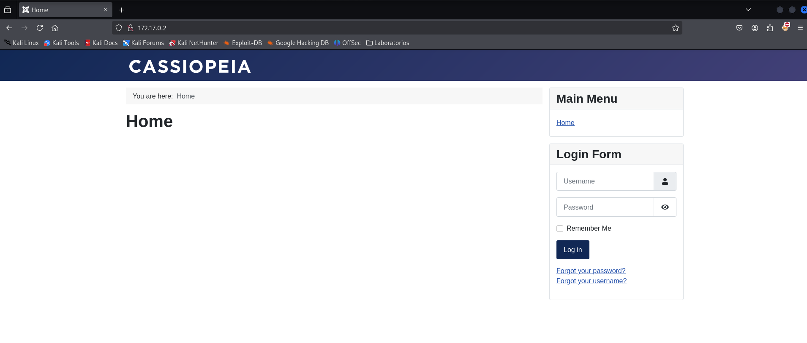

<p align="center">
    
</p>


Compruebo si está activa
```
ping -c 1 172.17.0.2
```

<p align="center">
    
</p>

---

## Enumeración
### Escaneo de puertos
- Primero hago un reconocimiento de puertos silencioso de los puertos abiertos
```
nmap -p- --open -sS --min-rate 5000 -n -Pn 172.17.0.2
```

<p align="center">
    
</p>


**Resultados del escaneo:**

| Puerto | Estado | Servicio |
| ------ | ------ | -------- |
| 80/tcp | open   | http     |


Realizamos un segundo escaneo al puerto abierto, lanzando una serie de script por defecto de `nmap` y reconocimiento de servicios.
```
nmap -p80 -sVC --min-rate 5000 -n -Pn 172.17.0.2
```

<p align="center">
    
</p>


| Puerto | Estado | Servicio | Versión                        |
| ------ | ------ | -------- | ------------------------------ |
| 80/tcp | open   | http     | Apache httpd 2.4.58 ((Ubuntu)) |

---


<h3><center> Análisis del servidor web HTTP (puerto 80)</center></h3>


Enumeramos las tecnologías con las que está hecha la aplicación web.
```
whatweb http://172.17.0.2
```

<p align="center">
    
</p>

Nos arroja bastante información y nos confirma que es un *Joomla*.


También vimos que el fichero `robots.txt` está habilitado, por lo que vamos a la URL para enumerar la información que tenemos en ese fichero.
<p align="center">
    
</p>

Encontramos muchísimas rutas y sobre todo, unas credenciales, con el usuario `admin` y la contraseña `c2FubHVpczEyMzQ1`. 


Al introducir la IP como la dirección URL, la web nos muestra lo siguiente:
<p align="center">
    
</p>


También en el fichero `robots.txt` encontramos  un directorio curioso `/un_caramelo`. Navegamos a esa ruta.
<p align="center">
    
</p>


Vemos que la web está en construcción. Si vemos el código fuente.
```
CTRL + U
```

<p align="center">
    
</p>


Vemos que alguien dejó unas credenciales que son iguales en las que vimos en el fichero `robots.txt`. Por lo que vemos la contraseña está encriptada en base 64, así que procedemos a desencriptarlo.
```
echo "c2FubHVpczEyMzQ1" | base64 -d 
```

<p align="center">
    
</p>


Vamos a la ruta `/administrator`, que también encontramos en el fichero `robots.txt`, si vamos al navegador y ponemos la URL
<p align="center">
    
</p>


Si ponemos las credenciales `admin:sanluis12345`.
<p align="center">
    
</p>

Le damos al botón del `login`.
<p align="center">
    
</p>


Entramos al panel de administración de *Joomla*. Buscamos la manera de inyectar una ejecución remota de comandos *RCE* o una `webshell`. Si vamos a `System/Site Templates`.
<p align="center">
    
</p>


Luego, ingresamos al templeate que usa la aplicación web, que es "Cassiopeia Details and Files".

Aquí podremos explorar opciones para modificar o cargar archivos que podrían llevar a una explotación de vulnerabilidades, como la posibilidad de ejecutar código en el servidor.
<p align="center">
    
</p>


Una vez dentro, veremos que podemos editar los archivos del template. En este caso, me centraré en el archivo `index.php`.
<p align="center">
    
</p>


Voy a la web de [ReverseShell][https://www.revshells.com/] y genero una `reverse shell` con el payload `PHP PentestMonkey`.
<p align="center">
    
</p>


Copio el código y lo pego en el `index.php` del `template` que está usando en `Joomla`.
<p align="center">
    
</p>


Guardamos la modificación del fichero `idex.php` y nos ponemos a la escucha con `netcat`, por el puerto que especificamos en la `reverse shell`.
```
nc -nvlp 1234 
```

<p align="center">
    
</p>


Vamos al navegador y ponemos en la URL la ruta donde carga el `index.php`.
<p align="center">
    
</p>


Se quedará cargando y si vamos a la terminal donde nos pusimos a la escucha con `netcat` podemos ver que recibimos una `reverse shell`.

<p align="center">
    
</p>


Enumerando el sistema si vamos a la carpeta `/home`, podemos encontrar dos usuarios.

<p align="center">
    
</p>

Si vamos dentro de donde está la web alojada `/var` y vamos al directorio `/backups`, dentro tenemos otro directorio `/hidden`, nos encontramos un fichero llamado `otro_caramelo.txt`.

<p align="center">
    
</p>


Si miramos el contenido del fichero `otro_caramelo.txt`

<p align="center">
    
</p>


Encontramos la contraseña del usuario `luisillo`. Pivotamos al usuario `luisillo` poniendo la contraseña que encontramos

<p align="center">
    
</p>

---

## POST-EXPLOTACIÓN

### Escalada de privilegios

Con el usuario `luisillo`, vamos a enumerar los posibles binarios que puede ejecutar
```
sudo -l
```

<p align="center">
    
</p>

Vemos que podemos ejecutar como cualquier usuario el binario `dd`. Si vamos a la web `GTFObins` y buscamos el binarios `dd`, nos indica que tenemos que introducir el siguiente comando.
```
echo "data" | sudo dd of=$LFILE
```
<p align="center">
    
</p>

Por lo que introducimos el comando
```
echo "luisillo ALL=(ALL:ALL) ALL" | sudo /bin/dd of=/etc/sudoers
```
Este comando, en esencia, **agrega una línea al archivo `sudoers`** que otorga al usuario `luisillo` todos los privilegios de administrador en el sistema. Esto significa que `luisillo` podrá ejecutar cualquier comando como si fuera el usuario root.

<p align="center">
    
</p>


Si ahora pivotamos al usuario `root`, poniendo la contraseña del usuario `luisillo` que es `luisillosuperpassword`
<p align="center">
    
</p>


Somos el usuario `root`.


