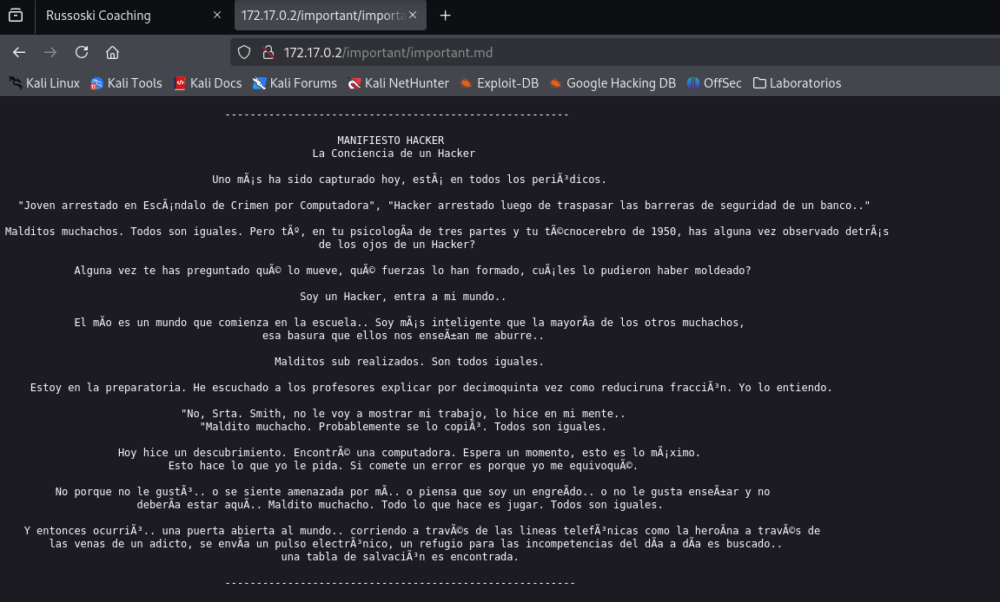

<p align="center">
    
</p>

Compruebo si está activa
```
ping -c 1 172.17.0.2
```

<p align="center">
    
</p>

---

## Enumeración
### Escaneo de puertos
- Primero hago un reconocimiento de puertos silencioso de los puertos abiertos
```
nmap -p- --open -sS --min-rate 5000 -n -Pn 172.17.0.2
```

<p align="center">
    
</p>


**Resultados del escaneo:**

| Puerto | Estado | Servicio |
| ------ | ------ | -------- |
| 21/tcp | open   | ftp      |
| 22/tcp | open   | ssh      |
| 80/tcp | open   | http     |

Realizamos un segundo escaneo al puerto abierto, lanzando una serie de script por defecto de `nmap` y reconocimiento de servicios.
```
nmap -p21,22,80 -sVC --min-rate 5000 -n -Pn 172.17.0.2
```

<p align="center">
    
</p>

**Resultados del escaneo:**

| Puerto | Estado | Servicio | **Versión**             |
| ------ | ------ | -------- | ----------------------- |
| 21/tcp | open   | ftp      | vsftpd 3.0.5            |
| 22/tcp | open   | ssh      | OpenSSH 9.6p1 Ubuntu    |
| 80/tcp | open   | http     | Apache/2.4.58  (Ubuntu) |


---


<h3><center> Análisis del Protocolo FTP (puerto 21)</center></h3>
Como `nmap` nos reportó con uno de sus script que tenemos acceso al servidor `ftp` por medio de una sesión con `anonymous`. Enumeramos que contiene el servicio
```
ftp 172.17.0.2
```

<p align="center">
    
</p>

Vemos que contiene dos fichero, por lo que procedemos a descargarlos
```
mget *
```

<p align="center">
    
</p>


Una vez descargados, vamos a nuestra máquina KALI para ver el contenido de los ficheros.
```
cat chat-goza.txt
```

<p align="center">
    
</p>

Vemos que son mensajes entre dos personas hablando de una tercera, es decir, podemos tener potenciales usuarios, `Gonza`, `Russoski` y `Nagore`. Y que tienen subido un video en una URL. Pasamos a ver el contenido del otro fichero.
```
cat pendientes.txt
```

<p align="center">
    
</p>


Son tareas pendientes y en una de ellas, nos indica que tiene algunas configuraciones que no son seguras.


---


<h3><center> Análisis del servidor web HTTP (puerto 80)</center></h3>
Al introducir la IP como la dirección URL, la web nos muestra lo siguiente:
![[Pasted image 20250101213556.png]]

Vemos que es una web personal de `Russoski`  que se anuncia como entrenador personal. Si vemos el código fuente podemos observar un comentario
```
CTRL + U
```
<p align="center">
    
</p>

Nos indica que en todos los servicios que usa tiene el mismo usuario. Procedemos a realizar `fuzzing web`

#### Fuzzing Web

Primero vamos a usar la herramienta `dirb`, que realiza un escaneo rápido.
```
dirb http://172.17.0.2
```

<p align="center">
    
</p>

Tenemos varias rutas interesantes. Si vamos al navegador y miramos dichas carpetas.

**/important**
Tenemos un fichero markdown `important.md` en el directorios `http://172.17.0.2/important/important.md`
<p align="center">
    
</p>

Es un manifiesto de un hacker que nombre a una tal `Srta. Smith`. Vamos a revisar la otra ruta.

**/backup**
Encontramos otro fichero `backup.txt`, que nos indica que en todos sus servicios tiene el usuario `russoski`.
<p align="center">
    
</p>

Por lo que teniendo un usuario ya confirmado como `russoski`, procedemos a realizar fuerza bruta al protocolo `SSH` con la herramienta `HYDRA`.

---


#### Hydra
Teniendo al usuario, realiza un ataque de fuerza bruta. 
```
hydra -l russoski -P /usr/share/wordlists/rockyou.txt ssh://172.17.0.2 -t 64
```

<p align="center">
    
</p>

Encontramos la contraseña para el usuario `camilo`. Por lo que iniciamos sesión en el protocolo `SSH`.
```
ssh russoski@172.17.0.2     # después ponemos la contraseña iloveme
```

<p align="center">
    
</p>

Iniciamos sesión en el servicio `SSH` con el usuario `russoski`. Enumerando el sistema podemos encontrar varias carpetas y ficheros, pero nada relevante.

<p align="center">
    
</p>

Así que intento escalar privilegios.

---

## Escalada de privilegios

Comprobamos que binarios puede ejecutar el usuario `russoski`.
```
sudo -l
```

<p align="center">
    
</p>

Vemos que podemos ejecutar el binario `vim`, sin proporcionar contraseña como el usuario `root`. Si voy a la web de [GTFObins][https://gtfobins.github.io/] y busco por el binario `vim` y selecciono que lo encontré realizando un `sudo`, me indica que:
<p align="center">
    
</p>

Ejecutando el comando indicado podemos lanzarnos una `bash`. Entonces ejecutamos el comando:
```
sudo /usr/bin/vim -c ':!/bin/bash'
```

<p align="center">
    
</p>

Somos el usuario `root`.