<p align="center">
    
</p>


Esta máquina llamada `Academy`, tiene un servidor Web abierto, la cual, está realizada con un gestor de contenido como es *Wordpress*. 

---

## Reconocimiento

Hacemos un descubrimiento de los hosts a los cuales tenemos acceso. Por la *MAC* que empieza por `08:00` podemos saber que es un Hosts virtualizado, por lo tanto sabemos la IP de la máquina victima *192.168.1.20*
```
sudo arp-scan -I eth0 --localnet
```

<p align="center">
    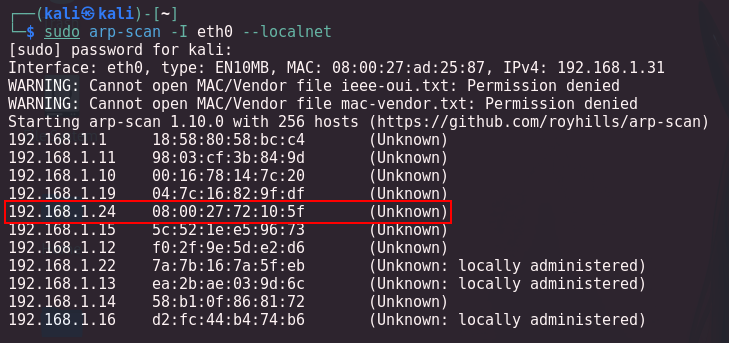
</p>


Realizamos un envío de paquetes para ver si tenemos conexión con la máquina
```
ping -c 1 192.168.1.24
```

<p align="center">
    
</p>

Tenemos conexión y vemos según el *TTL* que se trata de una máquina que tiene instalado un sistema operativo Linux.

---

## Enumeración

#### Escaneo de puertos
Realizamos un escaneo de puertos básico con **nmap** para identificar los puertos que están abiertos:
```
nmap -p- --open -sS --min-rate 5000 -n -Pn 192.168.1.24
```

<p align="center">
    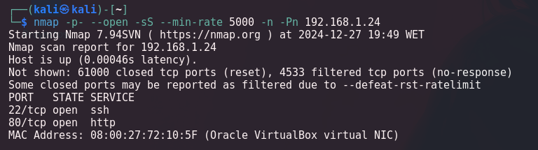
</p>


|Puerto|Servicio|Descripción|
|---|---|---|
|22/tcp|SSH|Secure Shell. Permite conexiones remotas seguras al sistema.|
|80/tcp|HTTP|Hypertext Transfer Protocol. Se utiliza para servir páginas web.|


Realizamos un segundo escaneo a los puertos abiertos, lanzando una serie de script por defecto de `nmap` y reconocimiento de servicios.
```
nmap -p22,80 -sVC --min-rate 5000 -n -Pn 192.168.1.24
```

<p align="center">
    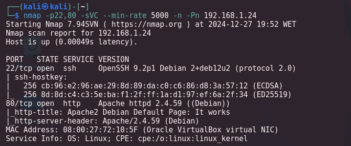
</p>

Nos nos arroja mucha información, sino las versiones de los servicios.

|Puerto|Estado|Servicio|Versión|Descripción|
|---|---|---|---|---|
|22/tcp|abierto|SSH|OpenSSH 9.2p1 Debian 2+deb12u2 (protocol 2.0)|Protocolo seguro para conexiones remotas. Permite administrar el sistema de forma segura desde otro equipo.|
|80/tcp|abierto|HTTP|Apache httpd 2.4.59 ((Debian))|Protocolo de transferencia de hipertexto. Se utiliza para servir páginas web. Apache es uno de los servidores web más populares.|


Realiza un reconocimiento de tecnologías en las que está hecha el servidor web
```
whatweb http://192.168.1.24
```

<p align="center">
    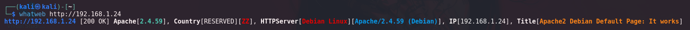
</p>

No nos da mucha información. Toca enumerar la página web

---

<h3><center> Análisis servicio HTTP  (puerto 80)</center></h3>

Vamos al navegador y en la URL ponemos la dirección IP
<p align="center">
    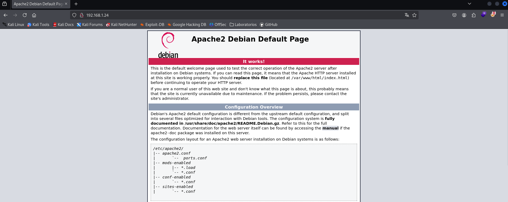
</p>

Efectivamente nos muestra la página de *Apache*, realizamos *Fuzzing Web* para encontrar posibles rutas, ficheros o directorios.

### Fuzzing Web

#### dirb
```
dirb http://192.168.1.24
```
<p align="center">
    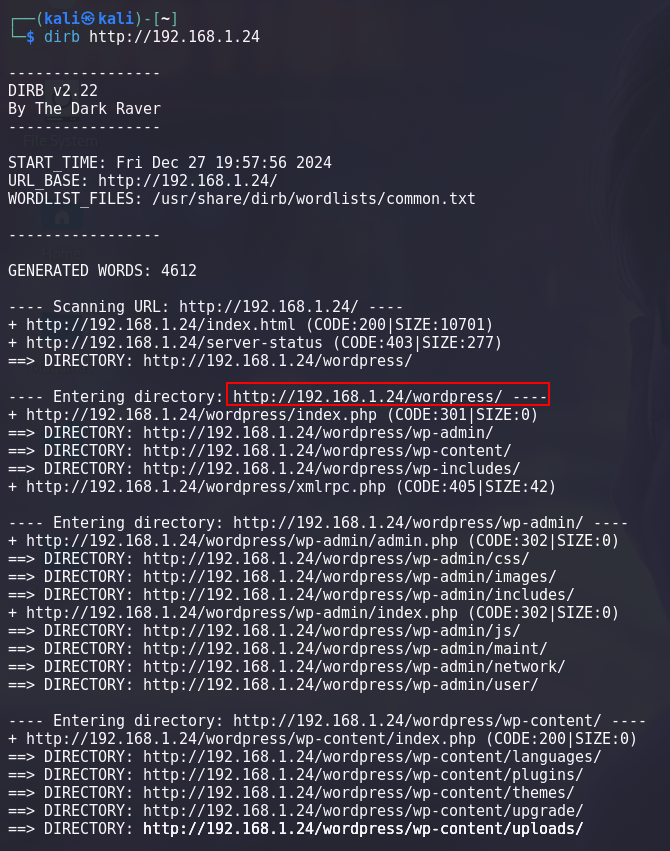
</p>


Nos indica que está realizada con *Wordpress*, así que nos dirigimos al navegador y poner la nueva URL
<p align="center">
    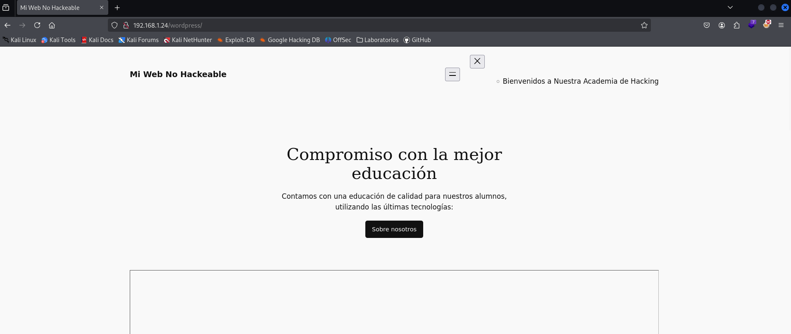
</p>

Se ve mal, si nos fijamos en el código fuente, podemos ver una URL que se repite `academy.thl`
<p align="center">
    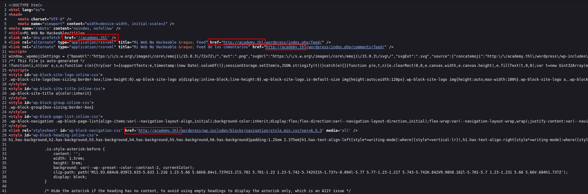
</p>

Tenemos que modificar nuestro `etc/hosts` y añadir a la IP de la victima este dominio.
```
sudo nano /etc/hosts
```

<p align="center">
    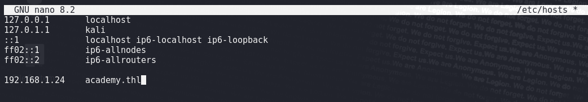
</p>


Si volvemos a recargar la página web
<p align="center">
    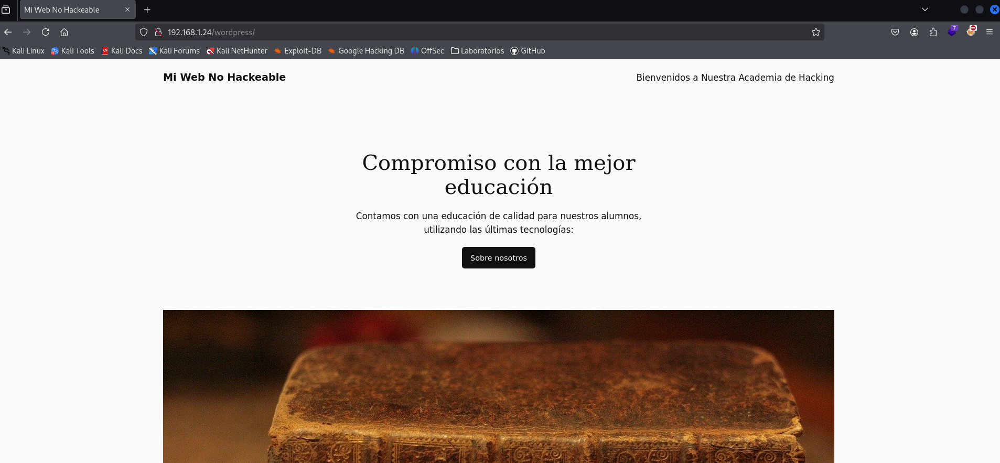
</p>

Ya la vemos bien. Ahora toca intentar enumerar posibles usuarios y los scripts instalados, por medio de estos a lo mejor podemos tener acceso y explotarlos


#### wpscan
```
wpscan --url http://academy.thl/wordpress --enumerate u,vp
```

<p align="center">
    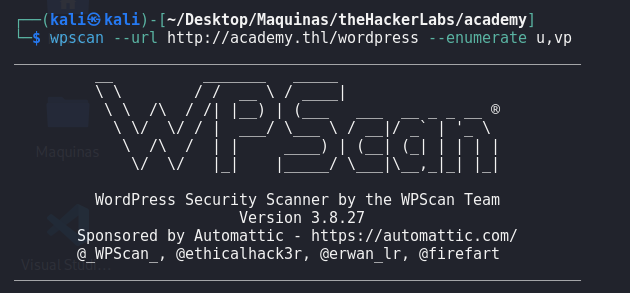
</p>
<p align="center">
    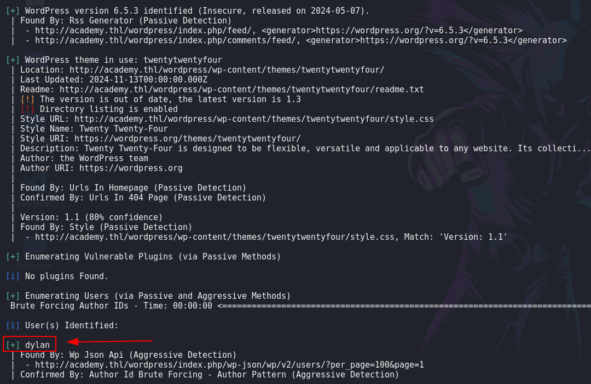
</p>


No encontró puglins instalados pero si usuario. `dylan`. Ahora con la misma herramienta vamos a realizar fuerza bruta para intentar conseguir la contraseña
```
wpscan --url http://academy.thl/wordpress --passwords /usr/share/wordlists/rockyou.txt --usernames dylan
```

<p align="center">
    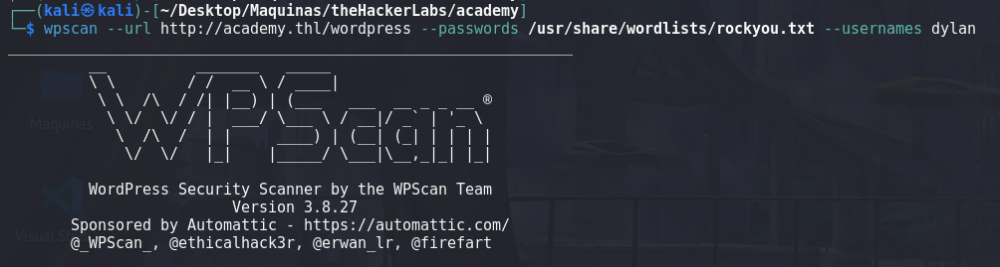
</p>
<p align="center">
    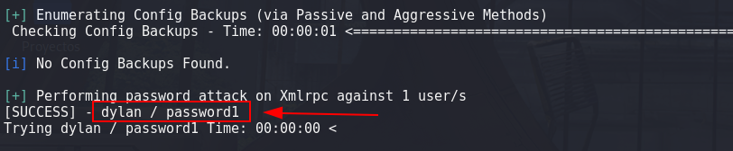
</p>

Nos encontró la contraseña `dylan:passwrod1`. Como todo wordpress nos dirigimos al panel de autenticación `wordpress/wp-login.php`, ó `wordpress/wp-admin`
<p align="center">
    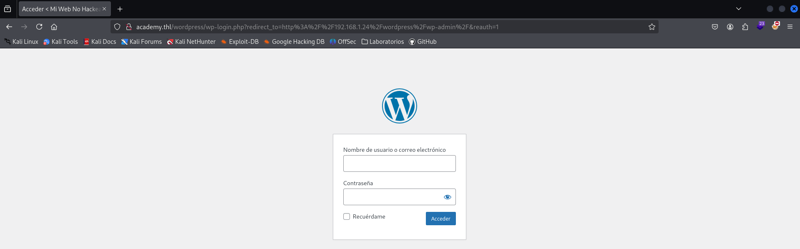
</p>


Entramos con las credenciales encontradas
<p align="center">
    
</p>


Y pudimos entrar y nos encontramos con el panel o dashboard del wordpress
<p align="center">
    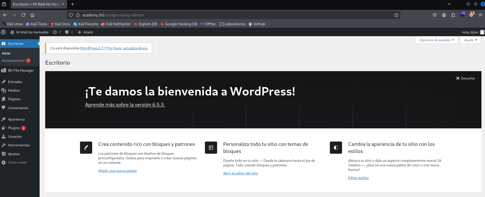
</p>


---

## Explotación

Podemos realizar la explotación de dos formas:
- Modificando algún a archivo del tema
- Cargando un fichero malicios


<h4><center>Modificando Plantilla de Temas</center></h4>


Podemos explotar este *Wordpress*, copiando el código de una `reverse shell` y modificando un archivo de la plantilla de temas en `php`. Si vamos a `Herramientas/editor de archivos de temas`, podemos encontrar todos los archivos que componen la web.
<p align="center">
    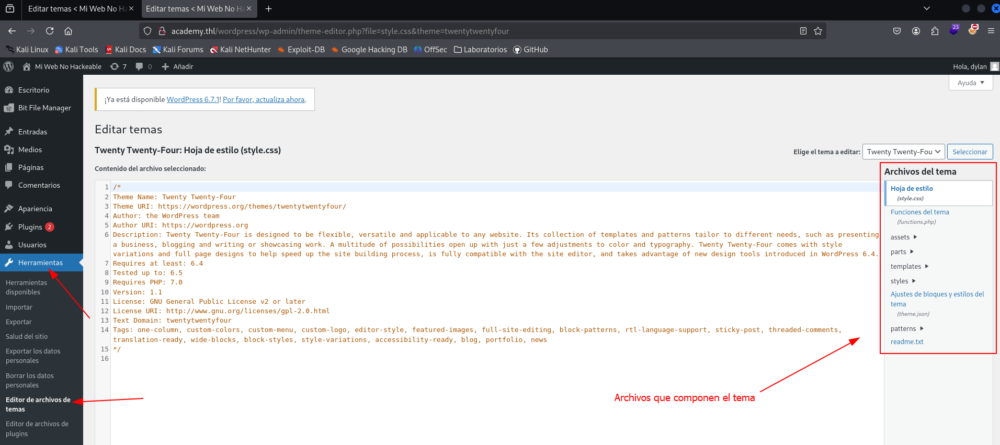
</p>


En los archivos del tema, podemos buscar alguno que tenga extensión `php`, para poder cargar una `reverse shell` con código `php` como por ejemplo la de *PentestMonkey*, en mi caso elijo el archivo `footer`. Mirar bien que ruta tiene este archivo.
<p align="center">
    
</p>


Modificamos el código. Copio el código de PentestMonkey de reverse shell y lo pego en el archivo footer.
<p align="center">
    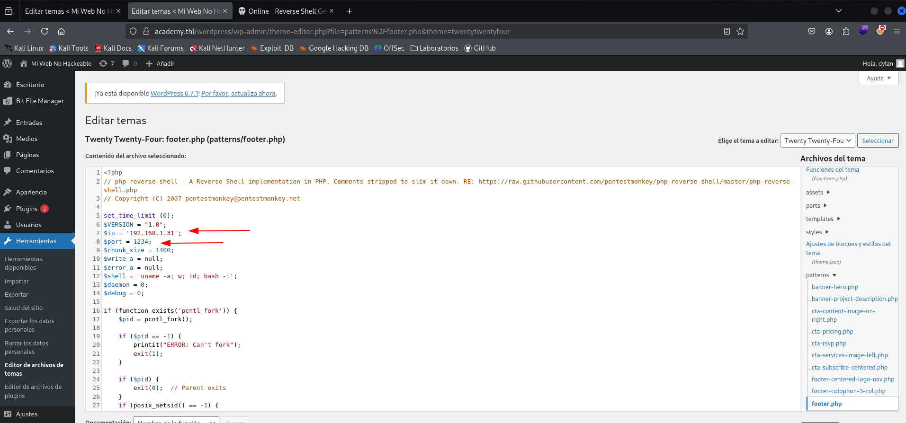
</p>


Pero al darle a guarda, no nos permite guardar el fichero.
<p align="center">
    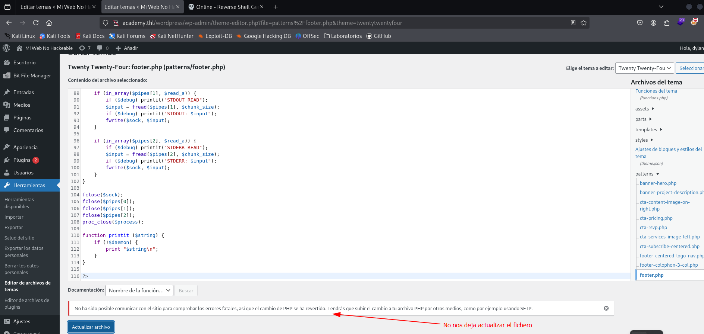
</p>


Tenemos que utilizar el segundo método.

---


<h4><center>Cargar Archivo Malicioso</center></h4>


Investigando este *Wordpress*, pude encontrar que está usando un plugin para cargar fichero. El plugin se llama `Bit File Manager`.
<p align="center">
    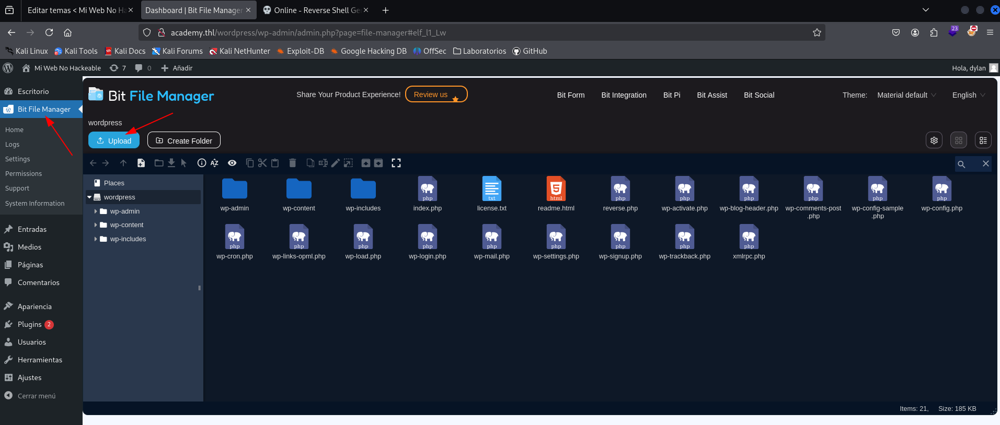
</p>


Creamos un fichero con extensión `php`, que nos de una `reverse shell`. Para ello voy a la web [Reverseshell][https://www.revshells.com/] y genero una `reverse shell` en `php`.
<p align="center">
    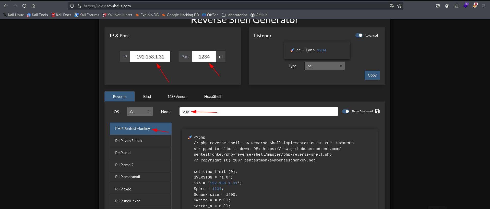
</p>


Copio el código y creo un fichero llamado `reverse.php`, donde pego el código copiado de la web anterior.
<p align="center">
    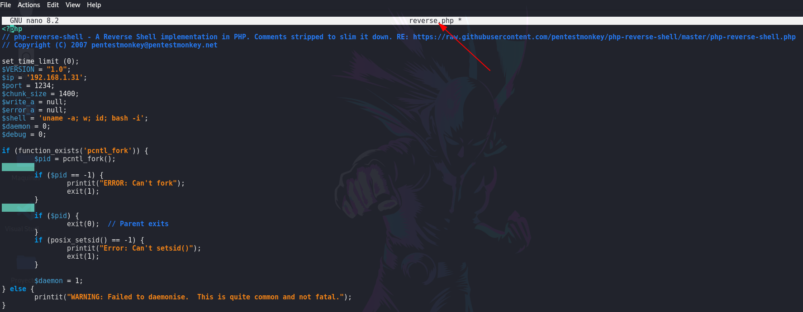
</p>


Voy al *Wordpress* y por medio del plugin cargo el fichero malicioso.
<p align="center">
    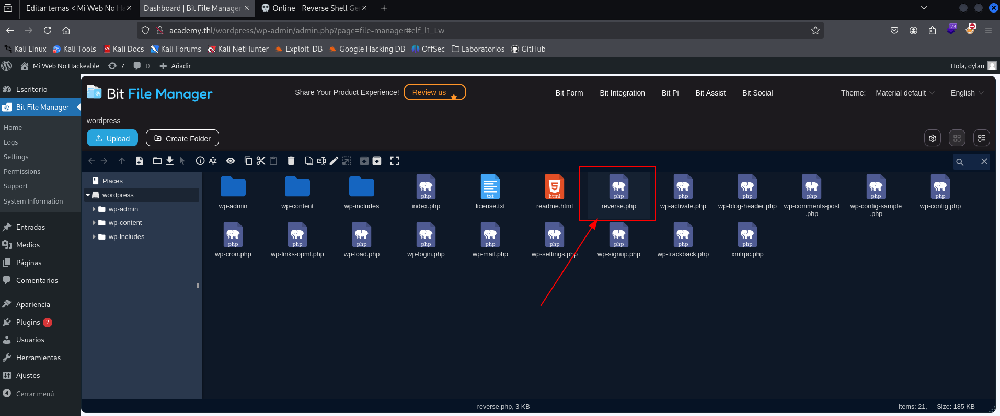
</p>


Como podemos ver en el explorar de archivos, el fichero que hemos subido está en la carpeta `wordpress/reverse.php`. Esto es importante para cuando vayamos a cargarlo. Antes de realizar la ejecución del fichero tenemos que ponernos a la escucha por el puerto especificado en fichero malicioso.
```
nc -nlvp 1234
```

<p align="center">
    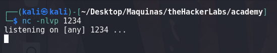
</p>


Ahora vamos al navegador y en la URL ponemos la dirección donde se encuentra el fichero malicioso `reverse.php`
<p align="center">
    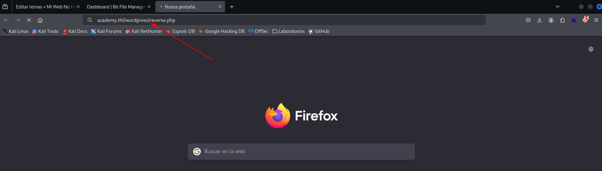
</p>


Vamos a la terminal donde estamos a la escucha y deberíamos haber recibido una `reverse shell`

<p align="center">
    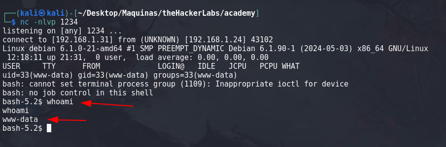
</p>


---

## Post-Explotación


Realicé el tratamiento de la *TTY*.
```bash
script /dev/null -c bash

www-data@host_/$ ^Z
zsh: suspended nc -nlvp 1234

~$> stty raw -echo; fg

[1]  + continued  nc -nlvp 443
                              reset
reset: unknown terminal type unknown
Terminal type? xterm

www-data@host:/$ export TERM=xterm
www-data@host:/$ export SHELL=bash

www-data@host:/$ stty rows 40 columns 123
```


### Enumeración

En los *Wordpress*, siempre hay un fichero de configuración que se llama `wp-config.php`, este fichero se encuentra el la ruta `/var/www/html/wordpress/wp-config.php`, si voy a esa ruta y veo el contenido del fichero
<p align="center">
    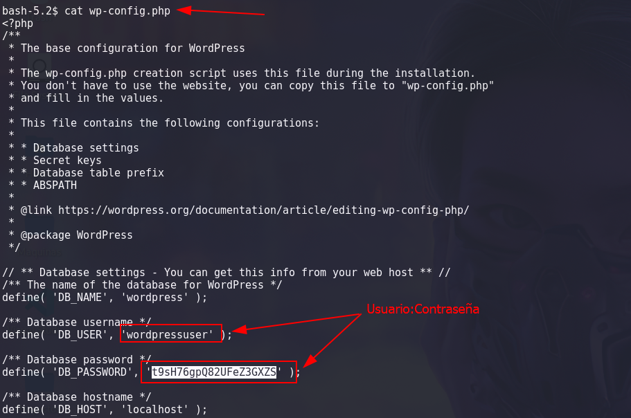
</p>


Obtenemos una credenciales de un usuario. `wordpressuser:t9sH76gpQ82UFeZ3GXZS`


---

## Privilegios

Realizamos la búsqueda de posibles binarios que el usuario `www-data` pueda ejecutar como usuario `roor`.
```
sudo -l
```

<p align="center">
    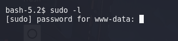
</p>


Pero requiere de contraseña. Comprobamos los `SUID`,  y encontramos un `SUID` que podemos explotar para escalar privilegios
```
find / -perm -4000 2>/dev/null
```

<p align="center">
    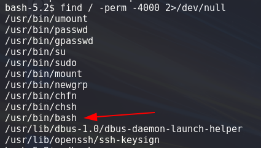
</p>


El binario que me llama la atención es `/usr/bin/bash`, si vamos a la web de [GTFObins][https://gtfobins.github.io/] y buscamos `bash`.

<p align="center">
    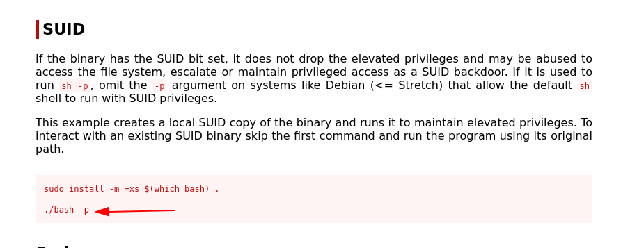
</p>


Nos indica que ejecutando ese comando podemos escalar privilegios. Por lo que ejecutamos el comando
```
bash -p
```

<p align="center">
    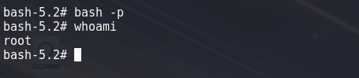
</p>


Ya somos el usuario `root`.


