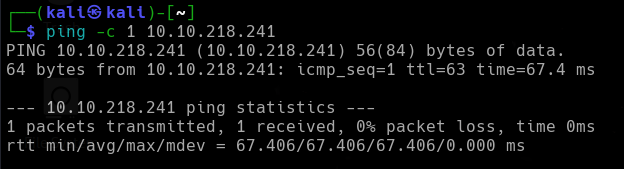

<p align="center">
    
</p>


Esta habitación es un remix de mi habitación anterior Retro con algunas complicaciones que añadí a esa habitación habiendo sido removida. Para mayor dificultad y ejercicio de paciencia, consulte esa habitación después de esto. Además, esta habitación es la secuela de Hijo.


*IP victima -> 10.10.102.152*

---


## Reconocimiento

Compruebo si tengo conexión con la máquina  y está activa
```
ping -c 1 10.10.102.152
```

<p align="center">
    
</p>

Tenemos conexión y su *TTL->63* me indica que puede ser una máquina con un sistema operativo **LINUX**.


---

## Enumeración
### Escaneo de puertos
- Primero hago un reconocimiento de puertos silencioso de los puertos abiertos
```
nmap -p- --open -sS --min-rate 5000 -n -Pn 10.10.218.241
```

